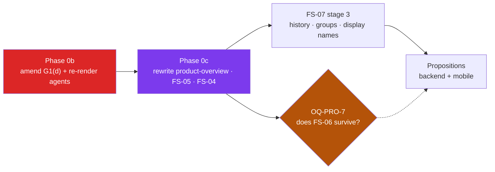

# Swab — Roadmap

> **The single answer to "what do we do next, and how?"**
> Companion to [STATUS.md](STATUS.md): STATUS says *what is done*, this file says *what is next and in what order*.
> Update this file whenever a task here starts, completes, or is re-sequenced. Detail per change still goes to the area changelogs (G5).

_Last reviewed: 2026-08-27 (against `main` @ `f07f0d2`)_

## How to use this file (read this first, every session)

1. Read [STATUS.md](STATUS.md) for module state, then this file for sequencing.
2. Work the phases **in order**. Within a phase, tasks marked `∥` can run in parallel.
3. Each task below has a **plan card**: goal, files, first step, acceptance, blockers.
4. One task = one issue = one branch = one PR (G4). Quote requirement IDs in branch, PR title, and test names.
5. Before implementing anything spec-driven, **re-read the current spec text** — do not trust a plan's quotation of it (see [`vlt04-stale-spec-citation`](../CLAUDE.md) precedent: ADR-001 invalidated older citations).

---

## Where we are

FS-01/02/03 are implemented but flagged 🟢⚠️ — green against the **retired** E2EE/vault design that [ADR-001](decisions/ADR-001-server-side-classification-data.md) superseded on 2026-08-16. FS-07 is mid-migration (ADR-001 stage 3): contacts CRUD and role routes have landed; **filter rules, subgroups, and history storage have not**.

The three unstarted specs (FS-04, FS-05, FS-06) are the actual product. Nothing shipped so far lets a user express an envie or receive a match — the core loop does not exist yet.

**The bottleneck is no longer technical — it is [ADR-002](decisions/ADR-002-envie-becomes-a-proposition.md).** On 2026-08-27 the product pivoted: an envie is now a *proposition*, directed and visible, answered by a group. FS-05 must be rewritten, FS-04 amended, FS-06's survival decided. Phase 0b — amending `agents/_global-directives.md` G1(d) so this is legal — is **done** (issue [#160](https://github.com/hamza-el-miqdam/swab/issues/160)); Phase 0c, the spec rewrites, is next and unblocked.

Everything **outside** the product surface — the IDT-03 security fix (Phase 1), the dependency queue (Phase 2), the infra work (Phase 4) — is untouched by the pivot and is where to spend time while the specs are rewritten.

### Critical path

⚠️ **Superseded 2026-08-27 by [ADR-002](decisions/ADR-002-envie-becomes-a-proposition.md).** The old path (FS-07 → FS-04 ∥ FS-06 → FS-05) assumed a matching engine, and the "FS-05 backend can start in parallel" insight rested on ENV-05, which is void. Do not sequence from it.



The new path is **provisional** — it firms up only once FS-05 is rewritten. Phase 0b is done: the binding directives now permit this work. Phase 0c (the spec rewrites) is next.

---

## Phase 0 — Founder decision gate ✅ RESOLVED 2026-08-27 → became a product pivot

The five parked FS-05 questions (OQ-ENV-1/2/3, ENV-17, ENV-19) are **dissolved, not answered**: all five presupposed a matching engine that will not be built.

**[ADR-002](decisions/ADR-002-envie-becomes-a-proposition.md) — an envie is now a proposition.** It is directed at people who see it, names what/when/where, and is answered by accept / counter-propose / ignore. Mutual reveal is gone. Groups stay **private to their owner**; a recipient learns only that the proposer wants to see them and that a few others are invited — never who, never how many — and reveals their own identity to the others only by choosing to. Swab shows responses but never decides. Read the ADR before touching FS-04, FS-05, FS-06, or `product-overview.md`. *(The ADR was revised the same day it was written — commitments 3–5 are the corrected group model; anything you remember about "shared groups" is void.)*

### Phase 0b — make the pivot legal ✅ DONE 2026-08-27

**Landed** via [SUG-SPEC-014](../suggestions/specs/SUG-SPEC-014-adr002-amend-binding-directives.md) and its Phase 2 propagation follow-up (issue [#160](https://github.com/hamza-el-miqdam/swab/issues/160)), branch `docs/adr002-phase0b-amend-directives`. [`agents/_global-directives.md`](../agents/_global-directives.md) G1(d) no longer says *"reveal stays strictly mutual"*; it now states the proposition model (directed, visible to recipients, silence never explained, no decline action anywhere). The same wording was propagated to the three agent files that carried their own independent copy of the old clause (`agents/backend-systems-specialist.md`, `agents/review-specialist.md`, `agents/spec-specialist.md`) and re-rendered to their `.github/instructions/*.md` and `.claude/agents/*.md` copies. Every agent can now do this work without rejecting it as a privacy violation.

**Plan card — Phase 0b (for reference / precedent)**
- **Order followed:** amended `agents/_global-directives.md` G1(d) → `node scripts/render-agents.mjs` (propagated to `.github/` + `.claude/agents/`) → `/speckit-constitution` resync (`.specify/memory/constitution.md` bumped 2.0.0 → 3.0.0, MAJOR) → updated `CLAUDE.md`'s app description + "Hard boundaries" → second pass amended the three independently-written agent files still asserting mutual reveal.
- **Exactly one clause changed — G1(d).** G1(a)/(b)/(c) were confirmed to need no amendment and were left untouched.
- **Kept, not deleted:** the rules that never depended on mutual reveal — IDT-08 one-directional classification, IDT-01 hashed phones, G3's never-log list, and the new *"silence is never explained"* rule that replaces ENV-11's purpose.
- **Acceptance:** `node scripts/render-agents.mjs --check` clean; `grep -rn "strictly mutual" --include="*.md" .` returns only allowed historical references (CHANGELOG.md, `docs/decisions/ADR-002-*.md`, `docs/archive/`, SUG-SPEC-014, and this file's own past-tense narrative).
- **Agent:** spec-specialist.
- 📋 **Executable plan: [SUG-SPEC-014](../suggestions/specs/SUG-SPEC-014-adr002-amend-binding-directives.md)** — carries the exact replacement string, the propagation order, and the greps that prove it landed.

### Phase 0c — rewrite the specs (`area:specs`)

In order: `product-overview.md` law 1 (law 4 loses only the four words « reveal is strictly mutual »; laws 2, 3, 5 are untouched) → **FS-05** (full rewrite, new requirement IDs) → **FS-04** (*amend*, don't rewrite — groups stay owner-private, so only manual creation + the FCA demotion change) → decide **FS-06**'s fate (OQ-PRO-7).

📋 **Executable plans, one per step — each is its own issue/branch/PR (G4):**

| # | Plan | Scope | Gate |
|---|---|---|---|
| 0c.1 | [SUG-SPEC-015](../suggestions/specs/SUG-SPEC-015-adr002-product-overview-laws.md) | Law 1 rewrite, law 4's four words, §1/§3/§6, glossary (`envie`/`portée`/`match`), root `README.md` | needs 014 |
| 0c.2 | [SUG-SPEC-016](../suggestions/specs/SUG-SPEC-016-adr002-fs05-rewrite.md) | FS-05 full rewrite, `ENV-* → PRO-*` disposition table, seam sketch, `area:db` + spec-kit handoffs | 🚦 **OQ-PRO-6 + OQ-PRO-1 must be answered first** |
| 0c.3 | [SUG-SPEC-017](../suggestions/specs/SUG-SPEC-017-adr002-fs04-amendment.md) | FS-04 amendment — manual CRUD, FCA→suggestion, the server-vs-device persistence split | needs 014 |
| 0c.4 | [SUG-SPEC-018](../suggestions/specs/SUG-SPEC-018-adr002-fs06-survival.md) | FS-06 survive/narrow/retire — three options, recommendation (B), founder decides | 🚦 **OQ-PRO-7** |

Two findings surfaced while writing the plans, both recorded in them:
- **OQ-PRO-10 (new)** — the amended G1(d) says *"no decline action anywhere"*, but FS-05's **« Passer cette fois »** is a decline that emits zero signal. Reconcilable, but the founder must say so; if it survives, G1(d) needs *"no decline action **that the proposer can observe**"*.
- **The FS-04 persistence split** — `OQ-SGR-2` says the FCA lattice is never persisted; ADR-002 says `Group`/`GroupMember` are server rows. Both are true, of *different objects*. If FS-04 doesn't say so explicitly, the next implementer will contradict one of them.

Nine open questions (OQ-PRO-1..9) are listed in the ADR. Two are load-bearing and should be answered with the founder *before* FS-05 is authored, not during:
- **OQ-PRO-6** — with no per-slot counters (law 5) and anonymous accepters allowed, what does a recipient actually see that lets the group converge on a time and place? If there is no good answer, group propositions need a narrower shape.
- **OQ-PRO-1** — refusing a proposition to a non-mutual contact leaks that they haven't added you, which is exactly what IDT-08 exists to prevent.

---

## Phase 1 — IDT-03 trust-proxy security fix ✅ DONE 2026-08-29 (branch `fix/163-idt03-trust-proxy-cidr`, PR #164)

**This was found by investigating why PR #158 was red, and it is not a dependency chore.**

Fastify **5.12.1** (a *patch* release) deliberately neutralised numeric `trustProxy`. From its `lib/request.js`:

```js
if (typeof tp === 'number') {
  // Hop-count-only trust cannot validate the immediate peer. Fail closed so
  // direct clients cannot spoof X-Forwarded-* values by supplying enough hops.
  return function () { return false }
}
```

It also removed `number` from the `trustProxy` type union — which is what produces all 9 `TS2345`/`TS2769` errors in [apps/api/src/app.ts](../apps/api/src/app.ts) (one root failure at line 86 cascades: the options object stops matching the plain overload, TS falls through to the http2-secure overload, and every `app`-derived type mismatches).

**Why this matters beyond the build:** [apps/api/src/app.ts:86](../apps/api/src/app.ts#L86) implements IDT-03 with exactly the pattern upstream just declared unsafe:

```ts
trustProxy: deps.env.TRUST_PROXY_HOPS > 0 ? deps.env.TRUST_PROXY_HOPS : false,
```

And [apps/api/CHANGELOG.md:109](../apps/api/CHANGELOG.md#L109) records the now-falsified rationale: *"an operator sets it to the real hop count, spoof-resistant unlike `trustProxy: true`"*. Hop counts are **not** spoof-resistant — a directly-connected client can forge `X-Forwarded-For` with enough hops and mint itself a fresh rate-limit bucket, defeating the IDT-03 OTP throttle.

**Current exposure: low but real.** `TRUST_PROXY_HOPS` defaults to `0` (fail-closed, header ignored) and there is no production deployment yet. The flaw only bites once an operator sets it `>0` behind a proxy. **Fix before first deploy, not an incident.**

**Plan card — Phase 1**
- **Goal:** replace hop-count trust with peer-address trust, and correct the spec + changelog rationale.
- **Files:** [apps/api/src/env.ts:15](../apps/api/src/env.ts#L15) · [apps/api/src/app.ts:86](../apps/api/src/app.ts#L86) · [apps/api/.env.example:15](../apps/api/.env.example#L15) · [apps/api/tests/auth.test.ts:216-260](../apps/api/tests/auth.test.ts#L216) · [apps/api/tests/env.test.ts:57-72](../apps/api/tests/env.test.ts#L57) · [apps/api/tests/helpers.ts:12](../apps/api/tests/helpers.ts#L12)
- **First step (TDD, G2):** rewrite the `TRUST_PROXY_HOPS=1` test at `auth.test.ts:238` — it currently asserts the *unsafe* behaviour (two forged XFF values get independent buckets). Replace with: trusted-CIDR peer → XFF honoured; untrusted peer → XFF ignored. Watch it fail, then implement.
- **Design:** swap `TRUST_PROXY_HOPS: z.coerce.number()` for `TRUST_PROXY: z.string().optional()` carrying a CIDR/IP allowlist (fastify accepts `string | string[] | boolean | TrustProxyFunction`). Keep the fail-closed default (unset → `false`). Document "set to your LB's subnet, e.g. `10.0.0.0/8`".
- **Acceptance:** `pnpm turbo run lint typecheck test build` green with fastify 5.12.1; a forged `X-Forwarded-For` from an untrusted peer cannot obtain a fresh bucket.
- **Also update:** `apps/api/CHANGELOG.md` (correct the falsified "spoof-resistant" claim — do not silently overwrite history; add a new dated entry), and `suggestions/backend/SUG-API-005-trust-proxy-rate-limit.md` (mark its premise superseded).
- **Spec check:** IDT-03 in [FS-07:15](specs/FS-07-identity-vault.md#L15) says only *"throttled per phoneHash and per IP"* — it does not mandate hop counts, so **no spec amendment is needed**. Confirm before assuming otherwise.
- **Sequencing:** do this as its own `area:api` PR. Do **not** bundle it into the Dependabot PR.

**Outcome:** implemented as designed — `TRUST_PROXY` (CIDR/IP allowlist) replaces `TRUST_PROXY_HOPS` in `env.ts`/`app.ts`, tests rewritten TDD-first, `apps/api/CHANGELOG.md` corrected via a new dated entry, `SUG-API-005` marked superseded. One deviation from the acceptance line above: **fastify was left at 5.12.0**, not bumped to 5.12.1 — the `?? false` fix (required anyway, for `exactOptionalPropertyTypes`) resolves the same `trustProxy` typing issue at the current version, so the bump is no longer a prerequisite; it can proceed as a plain dependency bump whenever Phase 2 gets to it. Full gate (`pnpm turbo run lint typecheck test build`) green locally with a real Postgres. Review (2026-08-29) also flagged `TRUST_PROXY`'s Zod schema as only checking non-empty, not CIDR/IP syntax — fixed with an explicit format validator in `env.ts` (`isValidTrustProxyList`, mirrors fastify's own `split(',').map(trim)` parsing) plus regression tests for malformed/out-of-range entries, so a typo now fails boot with a named `TRUST_PROXY` error instead of an unowned `@fastify/proxy-addr` `TypeError`.

---

## Phase 2 — Dependency queue ∥

Clear after Phase 1 lands, since #158 depends on the trust-proxy fix.

| PR | Change | Assessment |
|---|---|---|
| #158 | eslint 10.8.1→10.9.0, turbo 2.10.10→2.10.11, **fastify 5.12.0→5.12.1**, pglite 0.5.5→0.5.7 | Phase 1 landed (locally) — `app.ts`'s `trustProxy` is no longer numeric, so the 9-error `TS2345`/`TS2769` cascade should be gone once #158 rebases onto the fix. Not yet re-verified against an actual 5.12.1 install; rebase and re-run the gate before merging. |
| #131 | `@types/node` 22.20.0 → **26.2.0** | Major. Relates to issue #57 (Node 26 base image) — sequence them together, not separately. |
| #130 | `typescript` 5.8.3 → **6.0.3** | Major, on a strict-TS repo with type-aware ESLint. Expect fallout; own branch, full gate. |
| #123 | adminer 5 → 6 | Low risk — local dev tooling only. |
| #120 | espresso-core 3.6.1 → 3.7.0 | ⚠️ Verify against issue #56 first — the E2E suite needs an **API 34** emulator (API 35+ breaks Espresso). |
| #121 | kotlinx-coroutines-android 1.8.1 → 1.11.0 | Batch with #122; run `./gradlew test` + the Android E2E gate. |
| #122 | kotlinx-serialization-json 1.7.1 → 1.11.0 | Batch with #121. |

**Known trap (all Dependabot PRs):** the `scope` check fails with *"no recognized `area:*` label"* — Dependabot never labels its PRs. Apply the right `area:*` label manually before expecting green. Schema-touching PRs **hard-fail** without `area:db`.

**Second trap:** Dependabot retargets/rebases on merge of a sibling, and same-area PRs always collide on the area CHANGELOG. Test-merge probe first; poll `gh pr checks` on `.status`, not `.conclusion`.

---

## Phase 3 — The product (critical path)

> ⚠️ **Sections 3b–3e below are superseded by [ADR-002](decisions/ADR-002-envie-becomes-a-proposition.md) and kept only for the parts that survive the pivot.** 3b's match engine will not be built; 3c/3d/3e describe flows that no longer exist. **3a is still valid** (its history slice survives; its subgroup slice changes shape). Rewrite this whole section once Phase 0c lands FS-05. Requirement-level detail here is now unreliable — re-read the specs.

### 3a. FS-07 stage 3 — finish the ADR-001 migration 🔑 UNBLOCKER

**Plan card**
- **Goal:** land the three remaining server-side slices — **filter rules**, **subgroups** (names/pins/hidden only), **history**.
- **Why first:** FS-04 and FS-06 both declare `Depends on: FS-07 (ADR-001 storage/sync model)`. Nothing downstream can start cleanly without it.
- **Boundary to respect:** subgroup *membership* is **never** persisted server-side — the lattice is derived on-device (SGR-07, OQ-SGR-2). Only names, pins, and hidden flags are stored. ENV-05 depends on this being true.
- **Known db prerequisite:** the open `area:db` request for a monotonic sync sequence (`bigserial`) so the delta-pull cursor is a strict keyset — see `apps/api/CHANGELOG.md` 2026-08-22. Resolve this **before** adding more delta-pulled tables, or every new slice inherits the weak cursor.
- **Unblocks on completion:** issue #110 (remove the device-side history trim, once server-side retention exists), FS-04, FS-06.
- **Agents:** backend-specialist + data-steward (schema is `area:db`, one writer only).

### 3b. FS-05 backend — envies, match engine, proposals ∥ (parallel with 3a)

**Plan card**
- **Goal:** `POST /envies` + the match engine + the proposal loop. Runs in parallel with 3a because it consumes a client-supplied `recipientIds` list (ENV-05) and is agnostic to how that list was derived.
- **Blocked by:** Phase 0 only.
- **Head start — the schema is already largely in place.** [schema.prisma](../packages/db/prisma/schema.prisma) already has `Envie`, `EnvieRecipient`, `Match`, `Proposal`, `EnvieStatus`, `MatchState`, `ProposalState`, plus `@@unique([envieAId, envieBId])` (ENV-09 race arbiter), the canonical-ordering CHECK, and per-side `passedByAAt`/`passedByBAt` pass markers (ENV-15). STATUS.md understates this as *"users, envies + seed"* — **fix that line** when this starts.
- **Real db gap:** there is **no outbox table**. ENV-10 requires the outbox pattern so both parties are notified in one logical operation. This needs an `area:db` proposal.
- **Hardest requirements — treat as first-class test targets, not afterthoughts:**
  - **ENV-11** — non-matches must be *absolutely* unobservable: no response, **timing**, or push difference between "hasn't reciprocated" and "doesn't use the feature". This constrains implementation shape, not just output.
  - **ENV-15 bit-identity** — the counterpart's payload must be byte-identical whether or not the other side passed. The schema already carries a HAZARD note: `updatedAt` ticks when a pass marker is written, so **never** serialize `updatedAt` to a counterpart or it becomes a covert pass-signal.
  - **ENV-20** — `verb` stays opaque: never split, normalised, indexed, or full-text-searched, and never read by any server-side feature. Matching is category equality only.
  - **ENV-09** — match creation atomic in one serializable transaction; sort the pair before insert to satisfy the canonical-order CHECK.
  - **ENV-18** — `idempotencyKey` unique per author; retry returns the original envie (`200`, not `201`), with no second match and no second outbox notification.
- **First step:** draft the OpenAPI seam (`/envies`, `/matches`, `/proposals`) — the spec calls the API contract section "the seam" between backend and both mobile agents. No OpenAPI document exists in the repo yet; see `suggestions/backend/SUG-API-007-openapi-zod-typeprovider.md` for the intended Zod-typeprovider approach.
- **Acceptance:** ENV-08..12, ENV-17..20 covered by integration tests against real Postgres (G2 — no mocking Prisma).

### 3c. FS-06 — filtering rules (after 3a)

**Plan card**
- **Goal:** rule authoring UI + on-device evaluation; rules stored server-side.
- **Settled:** OQ-FLT-2 resolved 2026-08-22 — evaluation is **Swift + Kotlin only, no TS evaluator**. Do not build one.
- **Feeds:** ENV-03's "Inclus / Filtrés par tes règles" pre-send review, with the responsible rule level visible per person.
- **Watch:** FLT-02 — L1 *veto absolu* members appear in **neither** review list, not in a "filtered" list.
- **Agents:** ios-specialist ∥ android-specialist (+ backend for rule storage).

### 3d. FS-04 — subgroups (after 3a) ∥ with 3c

**Plan card**
- **Goal:** ~~automatic subgroup detection (FCA) on-device~~ → **ADR-002:** manual group CRUD is the base case; FCA is demoted to an opt-in suggestion. Groups remain **private to their owner** — that part is unchanged.
- ~~**Product law:** « tu ne définis jamais un groupe à la main » — no manual group creation, ever.~~ **Void (ADR-002).** Do not cite this line.
- **Feeds:** ~~ENV-02's scope picker, which lists FS-04 subgroups **only** — no individual selection~~ → proposing to a single person is now the base case.
- **Agents:** ios-specialist ∥ android-specialist (sole — no backend beyond FS-07's name/pin/hidden storage).

### 3e. FS-05 mobile — emission + reception UI (last)

**Plan card**
- **Blocked by:** 3a + 3b + 3c + 3d. This is genuinely last.
- **Scope:** verb input (ENV-01), scope picker (ENV-02), transparent pre-send review (ENV-03/04), calm post-send state (ENV-06), match surface + proposal loop (ENV-13/14/15).
- **Frozen French copy — verbatim, no paraphrase:** « Elle expire dans 48 heures. » · « Accepter la proposition » · « Passer cette fois » · « C'est parti, doucement. » · « Vous voulez vous proposer un truc ? »
- **Product law 5:** no « match ! » celebration, no counters, no delivery status, no seen-by, no pending counter — anywhere.
- **DoD:** full on-device E2E suite via `scripts/e2e-ios.sh` / `scripts/e2e-android.sh`, PASS with zero drift-guard failures, report pasted into the PR (G2).

---

## Phase 4 — Infrastructure hardening ∥

Parallelizable with Phase 3; none of it blocks the product.

| Item | Notes |
|---|---|
| Issue #57 — Node 26 base image | Corepack removal + toolchain alignment. Sequence **with** PR #131 (`@types/node` 26). |
| Issue #56 — Android toolchain | AGP 9, Kotlin 2.4, compileSdk 36. **Constraint:** E2E needs an API 34 emulator; API 35+ breaks Espresso. Gates PR #120. |
| Issue #92 — Prisma 7 | Move datasource url to `prisma.config.ts`. `area:db`, data-steward only. |
| Issue #70 — DEVELOPMENT.md | Still documents the removed Expo/RN app. Violates G5 ("code and docs never disagree on `main`"). Small, satisfying, do it any time. |
| Issue #110 — FCH-04 trim removal | **Blocked** on 3a's history slice. Not actionable alone. |
| E2E in CI | STATUS gap. Currently a local, agent-enforced gate only. |
| Privacy audit (playbook §6) | ⚪ Not started. **Required before any external tester** and after every schema/API change. Schedule after 3b — that's the most sensitive data path. Branch `specs/116-privacy-audit-wire-audit-post-adr001` exists. |
| Coverage enforcement in CI | G2 mandates 80% on changed packages; not currently enforced repo-wide. |
| OpenAPI diff gate | Only meaningful once 3b produces an OpenAPI document. |
| Notion spec re-sync | Stale since ADR-001 (2026-08-16). Deferred until the spec review (#64) settles. notion-liaison-specialist owns it. |
| Repo hygiene | Stale `.claude/worktrees/agent-*` directories are tracked in the working tree; several `origin/*` branches are merged-but-undeleted. |

---

## Session continuation protocol

**Starting a session:** read [STATUS.md](STATUS.md) → this file → the relevant `docs/specs/FS-*.md` **in full** (never trust a plan's quotation of spec text — ADR-001 invalidated many older citations).

**Finishing a task:** update this file's phase table, update [STATUS.md](STATUS.md) if a module changed state, append the area changelog (G5), and quote requirement IDs in the PR title.

**Environment gotchas worth not rediscovering:**
- Run `pnpm --filter @repo/db db:generate` **before** `typecheck` — the Prisma client is a build input and pnpm skips its postinstall script.
- The Postgres gates do not need Docker: the API repo is an injected seam — use `pnpm --filter @repo/api dev:local`.
- Android E2E requires an **API 34** emulator (API 35+ breaks Espresso — issue #56).
- Android `executeShellCommand` has no shell behind it: `Runtime.exec` tokenises and ignores quotes, silently no-oping `sh -c '...'`. Use `executeShellCommandRw("sh")` + stdin.
- Dependabot PRs need a manual `area:*` label or the scope guard fails closed.
