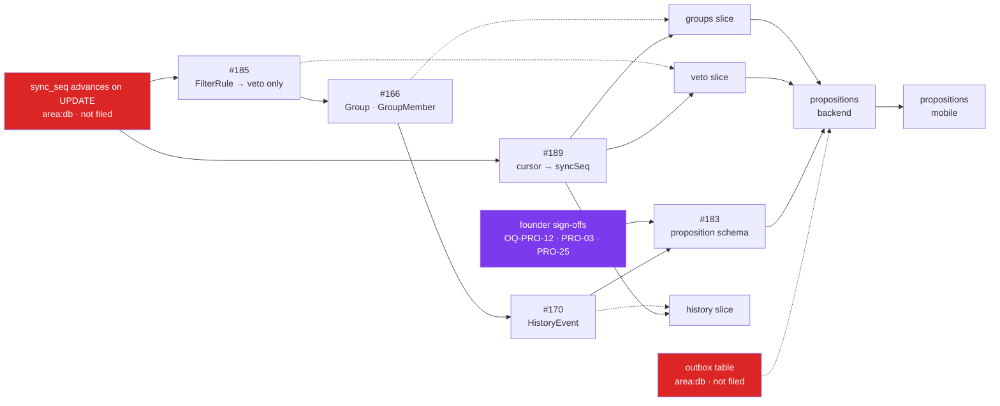

# Swab — Roadmap

> **The single answer to "what do we do next, and how?"**
> Companion to [STATUS.md](STATUS.md): STATUS says *what is done*, this file says *what is next and in what order*.
> Update this file whenever a task here starts, completes, or is re-sequenced. Detail per change still goes to the area changelogs (G5).

_Last reviewed: 2026-09-14 (against `main` @ `c5039c6`)_

## How to use this file (read this first, every session)

1. Read [STATUS.md](STATUS.md) for module state, then this file for sequencing.
2. Work the phases **in order**. Within a phase, tasks marked `∥` can run in parallel.
3. Each task below has a **plan card**: goal, files, first step, acceptance, blockers.
4. One task = one issue = one branch = one PR (G4). Quote requirement IDs in branch, PR title, and test names.
5. Before implementing anything spec-driven, **re-read the current spec text** — do not trust a plan's quotation of it (see [`vlt04-stale-spec-citation`](../CLAUDE.md) precedent: ADR-001 invalidated older citations).

---

## Where we are

FS-01/02/03 are implemented but flagged 🟢⚠️ — green against the **retired** E2EE/vault design that [ADR-001](decisions/ADR-001-server-side-classification-data.md) superseded on 2026-08-16. FS-07 is mid-migration (ADR-001 stage 3): contacts CRUD and role routes have landed; **veto, group, and history storage have not**.

The three unstarted specs (FS-04, FS-05, FS-06) are the actual product. Nothing shipped so far lets a user propose seeing someone — the core loop does not exist yet.

**The spec gate is cleared.** [ADR-002](decisions/ADR-002-envie-becomes-a-proposition.md) pivoted the product on 2026-08-27: an envie is a directed, visible proposition. Phase 0b made that legal; Phase 0c rewrote the specs — FS-05 as `PRO-01..26` (#184), FS-04 amended (#167), FS-06 narrowed to veto absolu (#182). Phases 1 and 2 are done too.

**The bottleneck is now the schema queue (Phase 3a).** Four `area:db` issues, plus one not yet filed, all edit `schema.prisma`, `seed.ts`, and `packages/db/CHANGELOG.md` through a single writer — they land one at a time, and each backend slice waits on its own item. Founder sign-offs (Phase 3e) gate the last one. Phase 4 runs alongside throughout.

### Critical path



Solid arrows are hard order. Dotted arrows mean each backend slice needs only *its own* schema item — the veto slice can start as soon as #185 and #189 land, without waiting for #183. The history slice feeds nothing else on this path: propositions needs veto + groups + the outbox table (not filed, same as the trigger), but **not** history — `HistoryEvent` (#170) sits on the schema queue only because `PRO-25` might extend it (see 3a.3's caveat), not because propositions reads it. Red is the next action; purple is the founder's.

---

## Phase 0 — Founder decision gate ✅ RESOLVED 2026-08-27 → became a product pivot

The five parked FS-05 questions (OQ-ENV-1/2/3, ENV-17, ENV-19) are **dissolved, not answered**: all five presupposed a matching engine that will not be built. *(One exception surfaced in the 0c.2 rewrite: OQ-ENV-2's expiry-semantics half — 48h vs same-day midnight — carries into FS-05; see Phase 3e.)*

**[ADR-002](decisions/ADR-002-envie-becomes-a-proposition.md) — an envie is now a proposition.** It is directed at people who see it, names what/when/where, and is answered by accept / counter-propose / ignore. Mutual reveal is gone. Groups stay **private to their owner**; a recipient learns only that the proposer wants to see them and that a few others are invited — never who, never how many — and reveals their own identity to the others only by choosing to. Swab shows responses but never decides. Read the ADR before touching FS-04, FS-05, FS-06, or `product-overview.md`. *(The ADR was revised the same day it was written — commitments 3–5 are the corrected group model; anything you remember about "shared groups" is void.)*

### Phase 0b — make the pivot legal ✅ DONE 2026-08-27

**Landed** via [SUG-SPEC-014](../suggestions/specs/SUG-SPEC-014-adr002-amend-binding-directives.md) and its Phase 2 propagation follow-up (issue [#160](https://github.com/hamza-el-miqdam/swab/issues/160)), branch `docs/adr002-phase0b-amend-directives`. [`agents/_global-directives.md`](../agents/_global-directives.md) G1(d) no longer says *"reveal stays strictly mutual"*; it now states the proposition model (directed, visible to recipients, silence never explained, no decline action anywhere). The same wording was propagated to the three agent files that carried their own independent copy of the old clause (`agents/backend-systems-specialist.md`, `agents/review-specialist.md`, `agents/spec-specialist.md`) and re-rendered to their `.github/instructions/*.md` and `.claude/agents/*.md` copies. Every agent can now do this work without rejecting it as a privacy violation.

**Plan card — Phase 0b (for reference / precedent)**
- **Order followed:** amended `agents/_global-directives.md` G1(d) → `node scripts/render-agents.mjs` (propagated to `.github/` + `.claude/agents/`) → `/speckit-constitution` resync (`.specify/memory/constitution.md` bumped 2.0.0 → 3.0.0, MAJOR) → updated `CLAUDE.md`'s app description + "Hard boundaries" → second pass amended the three independently-written agent files still asserting mutual reveal.
- **Exactly one clause changed — G1(d).** G1(a)/(b)/(c) were confirmed to need no amendment and were left untouched.
- **Kept, not deleted:** the rules that never depended on mutual reveal — IDT-08 one-directional classification, IDT-01 hashed phones, G3's never-log list, and the new *"silence is never explained"* rule that replaces ENV-11's purpose.
- **Acceptance:** `node scripts/render-agents.mjs --check` clean; `grep -rn "strictly mutual" --include="*.md" .` returns only allowed historical references (CHANGELOG.md, `docs/decisions/ADR-002-*.md`, `docs/archive/`, SUG-SPEC-014, and this file's own past-tense narrative).
- **Agent:** spec-specialist.
- 📋 **Executable plan: [SUG-SPEC-014](../suggestions/specs/SUG-SPEC-014-adr002-amend-binding-directives.md)** — carries the exact replacement string, the propagation order, and the greps that prove it landed.

### Phase 0c — rewrite the specs (`area:specs`)

In order: `product-overview.md` law 1 (law 4 loses only the four words « reveal is strictly mutual »; laws 2, 3, 5 are untouched) → **FS-05** (full rewrite, new requirement IDs) → **FS-04** (*amend*, don't rewrite — groups stay owner-private, so only manual creation + the FCA demotion change) → execute **FS-06**'s decided fate (OQ-PRO-7 → (B), narrowed to standing personal boundaries).

📋 **Executable plans, one per step — each is its own issue/branch/PR (G4):**

| # | Plan | Scope | Gate |
|---|---|---|---|
| 0c.1 | [SUG-SPEC-015](../suggestions/specs/SUG-SPEC-015-adr002-product-overview-laws.md) | Law 1 rewrite, law 4's four words, §1/§3/§6, glossary (`envie`/`portée`/`match`), root `README.md` | ✅ done (#162) |
| 0c.2 | [SUG-SPEC-016](../suggestions/done/specs/SUG-SPEC-016-adr002-fs05-rewrite.md) | FS-05 full rewrite, `ENV-* → PRO-*` disposition table, seam sketch, `area:db` + spec-kit handoffs | ✅ done (#184) |
| 0c.3 | [SUG-SPEC-017](../suggestions/specs/SUG-SPEC-017-adr002-fs04-amendment.md) | FS-04 amendment — manual CRUD, FCA→suggestion, the server-vs-device persistence split | ✅ done (#167) |
| 0c.4 | [SUG-SPEC-018](../suggestions/done/specs/SUG-SPEC-018-adr002-fs06-survival.md) | FS-06 survive/narrow/retire — three options, recommendation (B), founder decides | ✅ **done (B) 2026-09-13** — [FS-06](specs/FS-06-filtering.md) rewritten, `FLT-02` reworded |

All nine `OQ-PRO-*` open questions, plus two found while drafting these plans (`OQ-PRO-10`, and
`OQ-PRO-11` — a renumbering of a question SUG-SPEC-016 had miscited as `OQ-PRO-1`), are **resolved**.
Full text and resolutions: [ADR-002](decisions/ADR-002-envie-becomes-a-proposition.md#open-questions--resolved-2026-09-13-founder).
Headline ones:
- **OQ-PRO-6 (convergence)** — named revealers, plus a vague non-numeric cue for anonymous accepters.
- **OQ-PRO-1 (non-mutual refusal)** — silent accept-and-drop, no explicit error.
- **OQ-PRO-7 (FS-06 fate)** — **(B)** narrowed to standing personal boundaries (veto absolu only).
- **OQ-PRO-10 (decline collision)** — « Passer cette fois » is a local hide, not a decline; G1(d) needs no amendment.

~~**The FS-04 persistence split**~~ — **Resolved by 0c.3.** `OQ-SGR-2` says the FCA lattice is never
persisted; ADR-002 says `Group`/`GroupMember` are server rows. Both are true, of *different objects*,
and FS-04's new `SGR-15` now states this explicitly in one place, with an OQ-SGR-2 addendum confirming
it is not reopened.

**Next action:** none here — Phase 0c is complete (0c.1 #162, 0c.2 #184, 0c.3 #167, 0c.4 #182).
Implementation sequencing, including the `area:db` issues blocking FS-05 (#183) and FS-06 (#185),
lives in Phase 3.

---

## Phase 1 — IDT-03 trust-proxy security fix ✅ DONE 2026-08-29

**Landed** via issue #163 / PR [#164](https://github.com/hamza-el-miqdam/swab/pull/164), branch `fix/163-trust-proxy-cidr-allowlist`. `TRUST_PROXY_HOPS` (hop count) is replaced by `TRUST_PROXY`, a comma-separated CIDR/IP allowlist checked against the immediate peer; fail-closed default unchanged (unset → `false`). Fastify stays pinned at `^5.12.0` in `package.json` — the type/lint fallout was from the trust-proxy shape, not the fastify version, so no bump was needed. Full detail: `apps/api/CHANGELOG.md` 2026-08-29 entry. Unblocks Phase 2's PR #158.

**Plan card — Phase 1 (for reference / precedent)**

**This was found by investigating why PR #158 was red, and it is not a dependency chore.**

Fastify **5.12.1** (a *patch* release) deliberately neutralised numeric `trustProxy`. From its `lib/request.js`:

```js
if (typeof tp === 'number') {
  // Hop-count-only trust cannot validate the immediate peer. Fail closed so
  // direct clients cannot spoof X-Forwarded-* values by supplying enough hops.
  return function () { return false }
}
```

It also removed `number` from the `trustProxy` type union — which is what produces all 9 `TS2345`/`TS2769` errors in [apps/api/src/app.ts](../apps/api/src/app.ts) (one root failure at line 86 cascades: the options object stops matching the plain overload, TS falls through to the http2-secure overload, and every `app`-derived type mismatches).

**Why this matters beyond the build:** [apps/api/src/app.ts:86](../apps/api/src/app.ts#L86) implements IDT-03 with exactly the pattern upstream just declared unsafe:

```ts
trustProxy: deps.env.TRUST_PROXY_HOPS > 0 ? deps.env.TRUST_PROXY_HOPS : false,
```

And [apps/api/CHANGELOG.md:109](../apps/api/CHANGELOG.md#L109) records the now-falsified rationale: *"an operator sets it to the real hop count, spoof-resistant unlike `trustProxy: true`"*. Hop counts are **not** spoof-resistant — a directly-connected client can forge `X-Forwarded-For` with enough hops and mint itself a fresh rate-limit bucket, defeating the IDT-03 OTP throttle.

**Current exposure: low but real.** `TRUST_PROXY_HOPS` defaults to `0` (fail-closed, header ignored) and there is no production deployment yet. The flaw only bites once an operator sets it `>0` behind a proxy. **Fix before first deploy, not an incident.**

**Plan card — Phase 1**
- **Goal:** replace hop-count trust with peer-address trust, and correct the spec + changelog rationale.
- **Files:** [apps/api/src/env.ts:15](../apps/api/src/env.ts#L15) · [apps/api/src/app.ts:86](../apps/api/src/app.ts#L86) · [apps/api/.env.example:15](../apps/api/.env.example#L15) · [apps/api/tests/auth.test.ts:216-260](../apps/api/tests/auth.test.ts#L216) · [apps/api/tests/env.test.ts:57-72](../apps/api/tests/env.test.ts#L57) · [apps/api/tests/helpers.ts:12](../apps/api/tests/helpers.ts#L12)
- **First step (TDD, G2):** rewrite the `TRUST_PROXY_HOPS=1` test at `auth.test.ts:238` — it currently asserts the *unsafe* behaviour (two forged XFF values get independent buckets). Replace with: trusted-CIDR peer → XFF honoured; untrusted peer → XFF ignored. Watch it fail, then implement.
- **Design:** swap `TRUST_PROXY_HOPS: z.coerce.number()` for `TRUST_PROXY: z.string().optional()` carrying a CIDR/IP allowlist (fastify accepts `string | string[] | boolean | TrustProxyFunction`). Keep the fail-closed default (unset → `false`). Document "set to your LB's subnet, e.g. `10.0.0.0/8`".
- **Acceptance:** `pnpm turbo run lint typecheck test build` green with fastify 5.12.1; a forged `X-Forwarded-For` from an untrusted peer cannot obtain a fresh bucket.
- **Also update:** `apps/api/CHANGELOG.md` (correct the falsified "spoof-resistant" claim — do not silently overwrite history; add a new dated entry), and `suggestions/backend/SUG-API-005-trust-proxy-rate-limit.md` (mark its premise superseded).
- **Spec check:** IDT-03 in [FS-07:15](specs/FS-07-identity-vault.md#L15) says only *"throttled per phoneHash and per IP"* — it does not mandate hop counts, so **no spec amendment is needed**. Confirm before assuming otherwise.
- **Sequencing:** do this as its own `area:api` PR. Do **not** bundle it into the Dependabot PR.

---

## Phase 2 — Dependency queue ∥

**Cleared 2026-09-13.** Merged: #174, #175, #176, #123, #130, plus #177 (a Trivy base-image fix #130 needed). Deferred into issues: #121/#122 → #56, #131 → #57. The table keeps the original assessments with outcomes.

| PR | Change | Assessment → outcome |
|---|---|---|
| #158 | eslint 10.8.1→10.9.0, turbo 2.10.10→2.10.11, **fastify 5.12.0→5.12.1**, pglite 0.5.5→0.5.7 | ✅ **Superseded.** Dependabot closed it once #174 shipped the same group, bumped further (fastify 5.12.3, eslint 10.10.0, turbo 2.10.12, pglite 0.5.8) along with the fast-uri CVE fix. |
| #131 | `@types/node` 22.20.0 → **26.2.0** | ⏸ **Closed into issue #57.** Bump it together with the Node 26 base image, not on its own. |
| #130 | `typescript` 5.8.3 → **6.0.3** | ✅ **Merged.** Only fallout: TS 6 no longer accepts a Node `Buffer` as a Prisma `Bytes` value, so `upsertVault` now copies it with `new Uint8Array(buf)` (see `apps/api/CHANGELOG.md`). |
| #123 | adminer 5 → 6 | ✅ **Merged.** |
| #120 | espresso-core 3.6.1 → 3.7.0 | ✅ **Merged.** Full Android E2E gate PASS (38/38, no drift) on an API 34 emulator with the current AGP 8.5.2 / Kotlin 2.0.21. It never depended on #56. |
| #121 | kotlinx-coroutines-android 1.8.1 → 1.11.0 | ⏸ **Closed into issue #56.** Crashes the Kotlin 2.0.21 compiler. Needs the Kotlin uplift first. |
| #122 | kotlinx-serialization-json 1.7.1 → 1.11.0 | ⏸ **Closed into issue #56**, same blocker as #121. |

**Known trap (all Dependabot PRs):** the `scope` check fails with *"no recognized `area:*` label"* — Dependabot never labels its PRs. Apply the right `area:*` label manually before expecting green. Schema-touching PRs **hard-fail** without `area:db`.

**Second trap:** Dependabot retargets/rebases on merge of a sibling, and same-area PRs always collide on the area CHANGELOG. Test-merge probe first; poll `gh pr checks` on `.status`, not `.conclusion`.

---

## Phase 3 — The product (critical path)

**Rewritten 2026-09-14, after Phase 0c.** The previous 3a–3e sequenced the retired match engine, 3-tier filters, and name-only subgroups; they live in this file's git history, not in any current spec. **Requirement IDs below are pointers, not quotations — re-read the spec before implementing.**

Five tracks, plus a side list:

- **3a** — the schema queue: serial, one writer.
- **3b** — the cursor fix: runs in parallel once 3a.0 lands.
- **3c** — backend slices: each starts when its own schema item lands.
- **3d** — mobile slices: iOS and Android in parallel, each after its backend slice.
- **3e** — founder decisions.
- **3f** — spec/code drift to clear on the side.

### 3a. Schema queue — `area:db`, strictly serial 🔑 UNBLOCKER

Every item edits `schema.prisma`, `seed.ts`, `packages/db/tests/migrations.test.ts`, and `packages/db/CHANGELOG.md`. Parallel branches would conflict on all four, and the schema has one writer (G4). Land them one at a time, in this order:

| # | Issue | Change | Why this position |
|---|---|---|---|
| 3a.0 | ⚠️ **not filed** | `sync_seq` advances on UPDATE: a vanilla-Postgres `BEFORE UPDATE` trigger on `contact_links`, `contact_roles`, **and `filter_rules`** (all three already carry `syncSeq`), reusable by every later delta-pulled table. | Migration `20260830000000_monotonic_sync_sequence` makes `sync_seq` a column `DEFAULT`, so it only advances on INSERT. Every contact edit, tombstone, role change, and filter-rule edit is an UPDATE. #189 cannot land without this, and tables added after it get the trigger from day one. |
| 3a.1 | [#185](https://github.com/hamza-el-miqdam/swab/issues/185) | `FilterRule` slimmed to the veto-only shape (`FLT-09`). | Smallest item. It unblocks the veto slice, which proposition delivery needs. |
| 3a.2 | [#166](https://github.com/hamza-el-miqdam/swab/issues/166) | `Group`/`GroupMember`, owner-scoped (`SGR-10..15`). | Needed for `PRO-09`'s server-side group resolution. |
| 3a.3 | [#170](https://github.com/hamza-el-miqdam/swab/issues/170) | `HistoryEvent`, with `syncSeq` from day one and a 12-month retention sweep (`FCH-04`). | Goes before #183 so that *if* `PRO-25`'s acceptance event ends up extending `HistoryEvent`, the table already exists — **not yet decided**: #170's own body defers proposition/match events to "a separate future `area:db` issue", and #183 currently scopes the acceptance-event schema as new work of its own, with no reference back to #170. Settle this when #183 is drafted; until then, treat the ordering as a hedge, not a commitment. Unblocks #110. |
| 3a.4 | [#183](https://github.com/hamza-el-miqdam/swab/issues/183) | Proposition schema; retires `Match`/`MatchState`. | Last, because it waits on the 3e sign-offs. It breaks `seed.ts`, and the issue says so. |

**Gap not covered by any issue:** `PRO-10` requires an outbox, and no outbox table exists — the only "outbox" in `schema.prisma` is a comment about the client-side VLT-10 queue. #183 does not mention one. Amend #183 or file a sibling issue before 3a.4 starts.

**After 3a.4:** [#92](https://github.com/hamza-el-miqdam/swab/issues/92) (Prisma 7 — move `datasource.url` out of `schema.prisma` into `prisma.config.ts`) touches the same schema-adjacent, single-writer surface as this queue, even though it changes config rather than models. It was previously filed under Phase 4 as "parallelizable" — that's wrong for the same reason parallel 3a branches would conflict: queue it behind 3a.4 rather than running it alongside the product work.

**Agent:** data-steward. PRs **must** carry the `area:db` label or CI hard-fails.

### 3b. Delta-pull cursor → `syncSeq` — `area:backend` ∥

- **Issue:** [#189](https://github.com/hamza-el-miqdam/swab/issues/189). **Blocked on 3a.0:** a naive `syncSeq > cursor` against today's INSERT-only column silently drops every edit.
- **Why now:** every delta-pulled route added in 3c inherits whatever cursor exists, so #189 should land before the first new one.
- **Residual gap:** sequence allocation order ≠ commit order, so a pull that runs between two concurrent commits can skip a row.
  - This is not introduced by #189 — the current `updatedAt` cursor has the same gap.
  - #189 records the decision. A per-owner `pg_advisory_xact_lock` on writes closes the gap if it proves necessary.
- **When it lands:** drop the temporary `updatedAt` cursor indexes (`area:db`) and amend FS-07 `VLT-08` (see 3f).
- **Agent:** backend-specialist.

### 3c. Backend slices — `area:backend`, each after its own schema item

| Slice | Needs | Scope | Notes |
|---|---|---|---|
| Veto | 3a.1 + 3b | FS-06 `FLT-02`, `FLT-09` | CRUD on the per-contact veto. Enforcement — silently dropping vetoed contacts from `recipientIds` — belongs to the propositions slice. |
| Groups | 3a.2 + 3b | FS-04 `SGR-10..15`(a) | Owner-scoping is a query-layer authorization rule: no endpoint returns a group, its name, or its membership to anyone but its owner. The FCA lattice stays on-device (`SGR-15`(b)). |
| History | 3a.3 + 3b | FS-03 `FCH-04` | Server-side retention; after it, #110 removes the device-side trim. |
| **Propositions** | 3a.4 + veto + groups + outbox | FS-05 `PRO-07..16`, plus the server half of `PRO-17..26` | The most sensitive data path, and the last backend slice. |

**Propositions — treat these as first-class test targets, not afterthoughts:**
- **`PRO-11`** — ignoring must be absolutely unobservable. No response, timing, or push behaviour may differ across the six cases the spec lists. This constrains the implementation's shape, not just its output.
- **`PRO-23`** — the proposer's and every other recipient's views stay bit-identical whatever a single recipient does, except through the `PRO-21` convergence surface. The old ENV-15 hazard carries over: never serialize a timestamp that ticks on a recipient's action to anyone else.
- **`PRO-07` / `PRO-08`** — ineligible and muted recipients are silently accept-and-dropped (`201`). There is no error variant, ever.
- **`PRO-09`** — group → recipients resolution runs server-side, and no response ever names the group.
- **`PRO-15`** — `idempotencyKey` is unique per author. A retry returns the original with `200`, and never sends a second outbox notification.
- **`PRO-16`** — `verb` is opaque server-side: never split, normalised, indexed, searched, or read by any feature.

**First step:** the OpenAPI seam. FS-05's "API contract" section is only a sketch, and no OpenAPI document exists yet. The intended approach is [SUG-API-007](../suggestions/backend/SUG-API-007-openapi-zod-typeprovider.md); this also gives Phase 4's OpenAPI diff gate its first input.

**Acceptance:** integration tests against real Postgres (G2 — no mocking Prisma), named with their `PRO-*` IDs.

### 3d. Mobile slices — ios-specialist ∥ android-specialist

Each row follows its backend slice. **DoD for every row:**
- The full on-device E2E suite passes with zero drift-guard failures, and the report is pasted into the PR.
- Scenarios and the manifest are updated (G2).

| Slice | After | Scope |
|---|---|---|
| Veto toggle on the contact card | 3c veto | FS-06 `FLT-02` |
| Manual groups: create, edit membership, rename, delete | 3c groups | FS-04 `SGR-10..13`; accepting FCA suggestions (`SGR-14`) can follow |
| History reads, then #110's trim removal | 3c history | FS-03 `FCH-04` |
| Proposition emission | 3c propositions | FS-05 `PRO-01..06` |
| Proposition reception and response | 3c propositions + 3e copy | FS-05 `PRO-17..26` |

- **French copy:** take it from FS-05 at implementation time, never from this file. Two strings don't exist yet (see 3e).
- **Product law 5:** no « match ! », no counters, no delivery status, no « vu » — anywhere.
- **Not yet planned: the ADR-001 client stage.**
  - FS-01/02/03 are 🟢⚠️, built on the retired vault; STATUS notes what changes per spec.
  - The rework has no issue or plan card.
  - It touches the same local cache these slices read from, so plan it before the first mobile slice starts.

### 3e. Founder decisions — Hamza (+ design-specialist for copy)

None of these block 3a.0–3a.3 or their slices. The first three block 3a.4 (#183).

| Decision | Blocks | Where |
|---|---|---|
| `OQ-PRO-12` — button copy for the two accept modes | #183 (accept-mode naming), reception UI | FS-05 Open questions |
| `PRO-03` — the v0 category list | #183, emission UI | FS-05 `PRO-03`, `OQ-ENV-1` |
| `PRO-25` — acceptance-event grain, proposed `{date, category}` | #183; check against #170's shape | FS-05 `PRO-25` |
| `OQ-PRO-13` — French wording of the group-invite hint | reception UI | FS-05 `PRO-26` |
| `OQ-ENV-2` — fixed 48h vs same-day-midnight expiry | the propositions slice's `expiresAt` check | FS-05 `PRO-14`, Open questions |
| `PRO-14` — recipient cap, proposed N=150 | the propositions slice's validation | FS-05 `PRO-14` |

### 3f. Spec ↔ code drift — clear on the side

**Filed:**
- [#186](https://github.com/hamza-el-miqdam/swab/issues/186) — `product-overview.md` still describes the retired 3-tier filter system (`area:specs`).
- [#187](https://github.com/hamza-el-miqdam/swab/issues/187) — iOS `FicheFilterConsequence.swift` cites the retired FLT-01 (`area:ios`).
- [#188](https://github.com/hamza-el-miqdam/swab/issues/188) — Android `Fr.kt` cites the retired FLT-01 (`area:android`).

**Not filed** (all FS-07, `area:specs`):
- **`VLT-01`** stores subgroup state as "names, pins, hidden flags" only. FS-04 `SGR-15`(a) now persists manual groups, *with membership*, server-side.
- **`IDT-08`** says "until a match reveals a specific shared envie", which is the retired match model.
- **`VLT-08`** specifies the `updatedAt` cursor. Amend it when #189 lands.

---

## Phase 4 — Infrastructure hardening ∥

Parallelizable with Phase 3; none of it blocks the product. **Exception:** Issue #92 (Prisma 7 `datasource.url` → `prisma.config.ts`) moved into the 3a schema queue, immediately after 3a.4 — it shares the queue's single-writer constraint, so it isn't actually parallel.

| Item | Notes |
|---|---|
| Issue #57 — Node 26 base image | Corepack removal + toolchain alignment. Bump `@types/node` to 26 in the same PR (Dependabot #131 was closed into this issue 2026-09-13). |
| Issue #56 — Android toolchain | AGP 9, Kotlin 2.4, compileSdk 36. **Constraint:** E2E needs an API 34 emulator; API 35+ breaks Espresso. Also absorbs kotlinx-coroutines 1.11 / kotlinx-serialization 1.11 (Dependabot #121/#122, closed 2026-09-13), which crash the Kotlin 2.0.21 compiler. |
| Issue #70 — DEVELOPMENT.md | Still documents the removed Expo/RN app. Violates G5 ("code and docs never disagree on `main`"). Small, satisfying, do it any time. |
| Issue #110 — FCH-04 trim removal | **Blocked** on #170 + the 3c history slice. Not actionable alone. |
| E2E in CI | STATUS gap. Currently a local, agent-enforced gate only. |
| Privacy audit (playbook §6) | ⚪ Not started. **Required before any external tester** and after every schema/API change. Schedule after the 3c propositions slice — the most sensitive data path. Its wire-audit step was rewritten for ADR-001 (#145, merged); check it still fits ADR-002 before running it. |
| Coverage enforcement in CI | G2 mandates 80% on changed packages; not currently enforced repo-wide. |
| OpenAPI diff gate | Only meaningful once an OpenAPI document exists — the 3c propositions slice is its natural first producer. |
| Notion spec re-sync | Stale since ADR-001 (2026-08-16). Deferred until the spec review (#64) settles. notion-liaison-specialist owns it. |
| Repo hygiene | 24 `origin/*` branches are fully merged but undeleted (`git branch -r --merged origin/main`). `origin/chore/157-db-vitest4` shows unmerged though #157's change is in `packages/db/CHANGELOG.md` — confirm before deleting. `.claude/worktrees/` is gitignored, **not** tracked: the three leftover `agent-*` dirs are local clutter only (`git worktree list` → `git worktree remove`). |

---

## Session continuation protocol

**Starting a session:** read [STATUS.md](STATUS.md) → this file → the relevant `docs/specs/FS-*.md` **in full** (never trust a plan's quotation of spec text — ADR-001 invalidated many older citations).

**Finishing a task:** update this file's phase table, update [STATUS.md](STATUS.md) if a module changed state, append the area changelog (G5), and quote requirement IDs in the PR title.

**Environment gotchas worth not rediscovering:**
- Run `pnpm --filter @repo/db db:generate` **before** `typecheck` — the Prisma client is a build input and pnpm skips its postinstall script.
- The Postgres gates do not need Docker: the API repo is an injected seam — use `pnpm --filter @repo/api dev:local`.
- Android E2E requires an **API 34** emulator (API 35+ breaks Espresso — issue #56).
- Android `executeShellCommand` has no shell behind it: `Runtime.exec` tokenises and ignores quotes, silently no-oping `sh -c '...'`. Use `executeShellCommandRw("sh")` + stdin.
- Scope guard is advisory since 2026-09-16 — an unlabeled Dependabot PR now just warns instead of failing closed; the only label it still requires is `area:db` on a `packages/db/prisma/schema.prisma` diff.
