# Swab — Codebase Audit Suggestions (2026-07-20)

114 improvement suggestions produced by a read-only audit of the whole monorepo, run by the seven area specialist agents. **No code was changed** — every file here is a proposal only, and nothing has been committed.

## How to use these files

Each suggestion is one self-contained markdown file with a fixed template: problem with `file:line` evidence, a numbered implementation plan written so a smaller/cheaper model can execute it without re-investigating, tests & acceptance criteria, and risks. To implement one:

1. Open the suggestion file and hand it verbatim to the **implementing agent named in its header** (the `.claude/agents/*.md` subagents — e.g. `ios-specialist`, `data-steward`).
2. Follow normal workflow rules (G4): one suggestion = one issue = one branch = one PR, changelog entry in the same PR (G5), tests first (G2).
3. Suggestions are numbered by impact within each area (`001` = highest).

| Area | Folder | Files | Implementing agent |
|---|---|---|---|
| iOS | [ios/](ios/) | 18 | ios-specialist |
| Android | [android/](android/) | 18 | android-specialist |
| Backend (apps/api) | [backend/](backend/) | 16 | backend-specialist (data-steward where noted) |
| Database (packages/db) | [db/](db/) | 15 | data-steward |
| DevOps / CI | [devops/](devops/) | 19 | devops-specialist |
| Design system | [design/](design/) | 15 | design-specialist (+ platform agents where noted) |
| Specs / QA docs | [specs/](specs/) | 13 | spec-specialist |

## Execution order — dependency graph & model assignments

Model legend: **H** = Haiku 4.5 (mechanical, fully-specified edits) · **S** = Sonnet 5 (default: scoped code changes with tests) · **O** = Opus 4.8 / Fable 5 (cross-cutting contracts, refactors, judgment calls). The plan files were written so the implementing model doesn't need to re-investigate, so cheaper models go further than usual. Items on the same wave/track with no arrow between them can run in parallel.

```mermaid
flowchart TD
    subgraph W0["Wave 0 — decisions & spec truth"]
        VSHAPE["Vault canonical-shape decision(IOS-001 part 1) · O"]
        SPEC004["SPEC-004 veto visibility · O + founder"]
        SPEC009["SPEC-009 ring count · founder + S"]
        SPECFIX["SPEC-001 S · 002 H · 003 S · 005 H · 007 S · 010 H · 011 H · 013 H"]
        SPECENV["SPEC-006/008/012 envies reqs · S"]
    end
    subgraph W1["Wave 1 — foundations"]
        API001["API-001 devcode fail-closed · S"]
        DB002["DB-002 migrations baseline · S"]
        OPS013["OPS-013 CI Postgres · S"]
        OPS001["OPS-001 native tests in CI · S"]
        OPSMISC["OPS-002 S · 006+DES-003 H · 010 H · 012 H"]
    end
    subgraph W2A["Track A — schema (data-steward)"]
        DBREST["DB-001/003/005/006/007/008/009/011 · S<br/>DB-010/012/013/014/015 · H"]
    end
    subgraph W2B["Track B — auth"]
        API002["API-002 refresh rotation · O"]
        CLIENTAUTH["IOS-003 · S — AND-007 · S"]
    end
    subgraph W2C["Track C — vault"]
        IOS001["IOS-001 unify vault shape · O"]
        LOGSEAM["IOS-005 · S — AND-012 · S (logging seam)"]
        SYNC["IOS-002 · S — AND-001 · S (VLT-04 triggers)"]
        DECRYPT["IOS-004 · S — AND-004 · S (decrypt-failure UX)"]
        VHARD["IOS-007/009/018 S · IOS-012 H<br/>AND-006/010/013 · S"]
    end
    subgraph W2D["Track D — design tokens"]
        DES005["DES-005 generator validation · S"]
        DESTOK["DES-006/007/008/009 new tokens · S"]
        DES002["DES-002 ombre AA fix · O"]
        DES004["DES-004 consume typography + fonts · S"]
        DESMISC["DES-001 S · 010 H · 011 S · 012 S · 013/014/015 H"]
    end
    subgraph W2E["Track E — mobile UX/a11y"]
        ANDVM["AND-003 ViewModel lifecycle · O"]
        IOS011["IOS-011 decouple vault values from copy · O"]
        MOBUX["AND-002/005/008/009/014/015/016 S · AND-017/018 H<br/>IOS-008/010/015 S · IOS-013/014/016/017 H"]
    end
    subgraph W2F["Track F — devops chores"]
        OPSCHORE["OPS-003/007/009/011 · S<br/>OPS-004/005/008/014/015/016/017/018/019 · H"]
    end
    subgraph W3["Wave 3 — observability & test depth"]
        W3ITEMS["API-006/007/009/010 S · API-011 H<br/>DB-004 · S — IOS-006 · S — AND-011 · H"]
    end

    DB002 --> DBREST
    DB002 --> API002 --> CLIENTAUTH
    VSHAPE --> IOS001 --> SYNC
    IOS001 --> VHARD
    LOGSEAM --> DECRYPT
    SPEC009 --> MOBUX
    SPECENV -.pre-FS-05.-> W3ITEMS
    DES005 --> DESTOK --> DES004
    DESTOK --> MOBUX
    DES002 --> DESMISC
    OPS013 --> W3ITEMS
    OPS001 -.gates all mobile PRs.-> W2C
    API001 ~~~ W2B
```

### Wave 0 — decisions & spec truth (cheap, do first — wrong specs poison everything downstream)

| Order | Items | Model | Why first |
|---|---|---|---|
| 0.1 | [SPEC-002](specs/SUG-SPEC-002-fs07-status-header-drift.md) H · [SPEC-003](specs/SUG-SPEC-003-constitution-resync-drift.md) S · [SPEC-005](specs/SUG-SPEC-005-stale-rn-expo-paths-in-specs.md) H · [SPEC-010](specs/SUG-SPEC-010-playbook-and-headers-name-retired-mobile-agent.md) H · [SPEC-011](specs/SUG-SPEC-011-oq-env2-resolved-only-in-speckit.md) H · [SPEC-013](specs/SUG-SPEC-013-requirement-wording-precision-nits.md) H | H/S | Mechanical doc-truth fixes; agents read these files on every task |
| 0.2 | [SPEC-001](specs/SUG-SPEC-001-coverage-classes-overstate-api.md) S · [SPEC-007](specs/SUG-SPEC-007-fs03-taxonomy-oqs-unresolved.md) S | S | Honest coverage/OQ state before more implementation claims land |
| 0.3 | [SPEC-004](specs/SUG-SPEC-004-veto-visibility-contradiction.md) **O + founder** · [SPEC-009](specs/SUG-SPEC-009-ring-count-unspecified.md) **founder + S** · vault canonical shape (= [IOS-001](ios/SUG-IOS-001-vault-shape-cross-platform-divergence.md) part 1) **O** | O | Product/contract decisions that block Tracks C and E — decide once, in writing |
| 0.4 | [SPEC-006](specs/SUG-SPEC-006-envies-server-validation-gaps.md) · [SPEC-008](specs/SUG-SPEC-008-fch04-match-events-vault-path.md) · [SPEC-012](specs/SUG-SPEC-012-env13-exactly-three-actions-ambiguity.md) | S | Must be fixed before FS-05 implementation starts, not urgent for current code |

### Wave 1 — foundations (everything else builds on these)

| Order | Items | Model | Unblocks |
|---|---|---|---|
| 1.1 | [API-001](backend/SUG-API-001-devcode-fail-closed.md) devcode fail-closed | S | Nothing — it's the top security hole and a calibration run for the workflow |
| 1.2 | [DB-002](db/SUG-DB-002-no-migrations-baseline.md) migrations baseline | S | ALL of Track A + API-002; do before any schema change |
| 1.3 | [OPS-013](devops/SUG-OPS-013-ci-postgres-service.md) CI Postgres · [OPS-001](devops/SUG-OPS-001-native-tests-in-ci.md) native tests in CI | S | Wave 3 test suites; gates every mobile PR from here on |
| 1.4 | [OPS-002](devops/SUG-OPS-002-codeowners-scope-guard.md) scope guard S · [OPS-006](devops/SUG-OPS-006-token-drift-guard-ci.md)+[DES-003](design/SUG-DES-003-token-drift-check-not-in-ci.md) (one PR) H · [OPS-010](devops/SUG-OPS-010-node-version-ssot.md) H · [OPS-012](devops/SUG-OPS-012-ci-workflow-hardening.md) H | H/S | Guard rails before the PR volume of Wave 2 starts |

### Wave 2 — parallel tracks (independent of each other; order within track matters)

| Track | Sequence | Models |
|---|---|---|
| **A — schema** (data-steward, after DB-002) | [DB-001](db/SUG-DB-001-envie-recipient-missing-user-fk.md) → [DB-003](db/SUG-DB-003-match-reversed-pair-race.md) → [DB-007](db/SUG-DB-007-missing-fk-indexes.md) → [DB-008](db/SUG-DB-008-timestamps-without-timezone.md) → [DB-009](db/SUG-DB-009-contactlink-invite-dupes-selflink.md) → [DB-005](db/SUG-DB-005-envie-verb-not-nullable-retention.md) → [DB-006](db/SUG-DB-006-passed-state-per-side-modeling.md) → [DB-011](db/SUG-DB-011-typed-error-helpers-upsert-vault.md) (pairs with API-003), then batch [DB-010](db/SUG-DB-010-seed-wipe-guard.md)/[012](db/SUG-DB-012-vault-quota-check-and-createdat.md)/[013](db/SUG-DB-013-unbounded-string-columns.md)/[014](db/SUG-DB-014-seed-enum-state-coverage.md)/[015](db/SUG-DB-015-missing-updatedat-stateful-models.md) | S for schema changes, H for the final batch |
| **B — auth** | [API-002](backend/SUG-API-002-refresh-token-rotation.md) **O** (needs area:db proposal, after DB-002) → then in parallel [IOS-003](ios/SUG-IOS-003-no-token-refresh-or-401-handling.md) S + [AND-007](android/SUG-AND-007-refresh-token-never-used.md) S. Alongside, independent API hardening: [API-003](backend/SUG-API-003-upsert-vault-error-masking.md)/[004](backend/SUG-API-004-concurrent-signup-race.md)/[005](backend/SUG-API-005-trust-proxy-rate-limit.md)/[008](backend/SUG-API-008-otp-store-memory-growth.md)/[014](backend/SUG-API-014-graceful-shutdown-timeout.md)/[015](backend/SUG-API-015-displayname-control-chars.md) S · [API-012](backend/SUG-API-012-request-id-validation.md)/[013](backend/SUG-API-013-vault-version-int-overflow.md)/[016](backend/SUG-API-016-error-handler-message-passthrough.md) H | O once, rest S/H |
| **C — vault** (after the Wave-0 shape decision) | [IOS-001](ios/SUG-IOS-001-vault-shape-cross-platform-divergence.md) **O** (both-platform PRs) → [IOS-002](ios/SUG-IOS-002-vlt04-sync-triggers-missing.md)+[AND-001](android/SUG-AND-001-vault-sync-triggers-missing.md) S → [IOS-018](ios/SUG-IOS-018-vaultsync-conflict-path-gaps.md) S. In parallel: logging seam [IOS-005](ios/SUG-IOS-005-no-error-reporter-or-structured-logging.md)+[AND-012](android/SUG-AND-012-no-logging-or-error-reporting.md) S **before** decrypt-failure UX [IOS-004](ios/SUG-IOS-004-undecryptable-vault-silently-empty.md)+[AND-004](android/SUG-AND-004-vault-decrypt-failure-crashes-app.md) S (failures need somewhere to report). Then [IOS-007](ios/SUG-IOS-007-history-grows-unbounded-vs-quota.md)+[AND-013](android/SUG-AND-013-history-unbounded-growth.md) S, [AND-006](android/SUG-AND-006-session-tokens-plaintext-datastore.md) S, [AND-010](android/SUG-AND-010-vault-key-creation-race.md) S, [IOS-009](ios/SUG-IOS-009-filekeyvaluestore-durability-and-protection.md) S, [IOS-012](ios/SUG-IOS-012-securestore-lacks-delete.md) H | O once, rest S/H |
| **D — design tokens** | [DES-005](design/SUG-DES-005-generator-input-validation.md) S → [DES-009](design/SUG-DES-009-spacing-scale-drift.md)/[006](design/SUG-DES-006-etat-palette-outside-ssot.md)/[007](design/SUG-DES-007-motion-tokens-missing.md)/[008](design/SUG-DES-008-accent-tints-not-tokenized.md) S → [DES-004](design/SUG-DES-004-typography-tokens-unconsumed-fonts-unbundled.md) S. [DES-002](design/SUG-DES-002-ombre-fails-wcag-aa.md) **O** (color choice) anytime. Then [DES-001](design/SUG-DES-001-stale-pre-nuit-blueprints.md) S, [DES-011](design/SUG-DES-011-touch-targets-below-minimum.md)/[012](design/SUG-DES-012-dynamic-type-and-letterspacing-contract.md) S, [DES-010](design/SUG-DES-010-envie-expiry-copy-48h-vs-24h.md) H (after SPEC-011 confirms 24h), [DES-013](design/SUG-DES-013-duplicate-consolidated-prototype.md)/[014](design/SUG-DES-014-off-token-colors-in-prototype.md)/[015](design/SUG-DES-015-stale-owner-link-design-system.md) H | O once, rest S/H |
| **E — mobile UX/a11y** | [AND-003](android/SUG-AND-003-viewmodel-lifecycle-and-recreation.md) **O** first (touches every screen — do before other Android UI PRs to avoid rebasing them all). [IOS-011](ios/SUG-IOS-011-classification-values-coupled-to-french-copy.md) **O** (vault value decoupling). Then S batch: [AND-002](android/SUG-AND-002-chip-rows-overflow-rings-unreachable.md)/[005](android/SUG-AND-005-contact-import-unwired.md)/[008](android/SUG-AND-008-map-nodes-talkback-activation.md)/[009](android/SUG-AND-009-node-text-contrast-on-etat-colors.md) (after DES-006)/[014](android/SUG-AND-014-calibration-not-radial.md) (after SPEC-009)/[015](android/SUG-AND-015-input-fields-keyboard-and-semantics.md)/[016](android/SUG-AND-016-release-build-unminified.md), [IOS-008](ios/SUG-IOS-008-hardcoded-baseurl-salt-devcode.md)/[010](ios/SUG-IOS-010-dynamic-type-and-input-traits.md)/[015](ios/SUG-IOS-015-calibrate-duplicates-geometry-and-vocab.md). H batch: [AND-017](android/SUG-AND-017-duplicated-vocabulary-lists.md)/[018](android/SUG-AND-018-dead-code-and-hygiene.md), [IOS-013](ios/SUG-IOS-013-contacts-list-identity-and-dedupe.md)/[014](ios/SUG-IOS-014-ring-range-unvalidated.md)/[016](ios/SUG-IOS-016-e2e-preflight-uses-health-not-ready.md)/[017](ios/SUG-IOS-017-dead-code-route-for-step.md) | O twice, rest S/H |
| **F — devops chores** | S: [OPS-003](devops/SUG-OPS-003-gitleaks-trivy-scanning.md)/[007](devops/SUG-OPS-007-production-api-image.md)/[009](devops/SUG-OPS-009-turbo-cache-in-ci.md)/[011](devops/SUG-OPS-011-portability-lint.md) · H: [OPS-004](devops/SUG-OPS-004-dependabot-config.md)/[005](devops/SUG-OPS-005-pin-actions-to-shas.md)/[008](devops/SUG-OPS-008-dockerfile-frozen-lockfile-digest.md)/[014](devops/SUG-OPS-014-compose-healthcheck-loopback.md)/[015](devops/SUG-OPS-015-dockerignore-context-bloat.md)/[016](devops/SUG-OPS-016-script-strict-mode.md)/[017](devops/SUG-OPS-017-turbo-global-deps-tsconfig.md)/[018](devops/SUG-OPS-018-prisma-validate-gate.md)/[019](devops/SUG-OPS-019-stale-rn-era-config.md) — any order, fully parallel | S/H |

### Wave 3 — observability & test depth (needs Wave 1 CI + Wave 2 code shape settled)

| Items | Model | Depends on |
|---|---|---|
| [DB-004](db/SUG-DB-004-no-db-level-tests.md) db test suite · [API-006](backend/SUG-API-006-postgres-integration-tests.md) integration suite | S | OPS-013 (CI Postgres), Track A landed |
| [API-007](backend/SUG-API-007-openapi-zod-typeprovider.md) OpenAPI/type-provider · [API-009](backend/SUG-API-009-otel-metrics.md) OTel · [API-010](backend/SUG-API-010-log-privacy-regression-tests.md) log-privacy tests | S | Route surface stable (Track B done); prerequisite for FS-05 work |
| [API-011](backend/SUG-API-011-otp-store-unit-tests.md) OtpStore tests · [AND-011](android/SUG-AND-011-coverage-threshold-not-enforced.md) Jacoco floor | H | AND-011 after Track E lands (or the floor fails immediately) |
| [IOS-006](ios/SUG-IOS-006-swabui-viewmodels-have-zero-unit-tests.md) SwabUI test target | S | After IOS-011/Track C refactors (test the settled shape, not the old one) |

### Practical notes

- Launch the area subagent named in each suggestion's header and paste the file as the prompt; subagents inherit the session model, overridable per-run (the Agent tool takes a model override, or `claude --model sonnet` / `claude --model haiku`).
- One suggestion = one branch = one PR (G4); changelog entry in the same PR (G5).
- Whatever model implements, keep the review gate (`/code-review`, plus the CI from Wave 1) — cheap model + strong review beats expensive model + no review.
- Rough model split across the 114 items: ~7 Opus-class (the contract/refactor decisions), ~65 Sonnet, ~42 Haiku.

## Cross-cutting themes (fix together)

These findings surfaced independently in several areas and should be coordinated as single initiatives rather than per-area patches:

- **Refresh-token flow is missing end-to-end.** The API issues refresh tokens but has no `/auth/refresh` endpoint ([SUG-API-002](backend/SUG-API-002-refresh-token-rotation.md), needs an `area:db` proposal), and both apps store the token but never use it, so expired sessions silently die ([SUG-IOS-003](ios/SUG-IOS-003-no-token-refresh-or-401-handling.md), [SUG-AND-007](android/SUG-AND-007-refresh-token-never-used.md)). Implement server-side first, then both clients.
- **VLT-04 vault sync triggers unimplemented on both platforms.** Vault is pushed exactly once at end of onboarding ([SUG-IOS-002](ios/SUG-IOS-002-vlt04-sync-triggers-missing.md), [SUG-AND-001](android/SUG-AND-001-vault-sync-triggers-missing.md)).
- **Vault blob shape diverges between iOS and Android** — the same blob is not round-trippable across platforms ([SUG-IOS-001](ios/SUG-IOS-001-vault-shape-cross-platform-divergence.md)). Agree the canonical shape before touching either client.
- **Undecryptable vault = silent data loss (iOS) or crash loop (Android)** ([SUG-IOS-004](ios/SUG-IOS-004-undecryptable-vault-silently-empty.md), [SUG-AND-004](android/SUG-AND-004-vault-decrypt-failure-crashes-app.md)).
- **Vault history grows unbounded vs the 1 MB quota** on both platforms ([SUG-IOS-007](ios/SUG-IOS-007-history-grows-unbounded-vs-quota.md), [SUG-AND-013](android/SUG-AND-013-history-unbounded-growth.md)).
- **CI doesn't run what matters:** native tests never run in CI ([SUG-OPS-001](devops/SUG-OPS-001-native-tests-in-ci.md)), the design-token drift guard isn't wired ([SUG-OPS-006](devops/SUG-OPS-006-token-drift-guard-ci.md) / [SUG-DES-003](design/SUG-DES-003-token-drift-check-not-in-ci.md) — same fix), no Postgres service for integration tests ([SUG-OPS-013](devops/SUG-OPS-013-ci-postgres-service.md) ↔ [SUG-API-006](backend/SUG-API-006-postgres-integration-tests.md), [SUG-DB-004](db/SUG-DB-004-no-db-level-tests.md)), Android coverage floor not enforced ([SUG-AND-011](android/SUG-AND-011-coverage-threshold-not-enforced.md)).
- **G3 observability unimplemented on mobile:** no logging/error-reporter seam, failures swallowed ([SUG-IOS-005](ios/SUG-IOS-005-no-error-reporter-or-structured-logging.md), [SUG-AND-012](android/SUG-AND-012-no-logging-or-error-reporting.md)); API lacks OTel metrics ([SUG-API-009](backend/SUG-API-009-otel-metrics.md)).
- **WCAG AA contrast failures:** the `ombre` token fails on every Nuit surface ([SUG-DES-002](design/SUG-DES-002-ombre-fails-wcag-aa.md)); node initials on état colors ≈2:1 ([SUG-AND-009](android/SUG-AND-009-node-text-contrast-on-etat-colors.md)).
- **Retired RN/Expo era still referenced** in specs, playbook, and configs ([SUG-SPEC-005](specs/SUG-SPEC-005-stale-rn-expo-paths-in-specs.md), [SUG-SPEC-010](specs/SUG-SPEC-010-playbook-and-headers-name-retired-mobile-agent.md), [SUG-OPS-019](devops/SUG-OPS-019-stale-rn-era-config.md)).
- **Hardcoded dev constants shipped in both apps** (base URL, phone-hash salt, dev-OTP UI): [SUG-IOS-008](ios/SUG-IOS-008-hardcoded-baseurl-salt-devcode.md), [SUG-AND-018](android/SUG-AND-018-dead-code-and-hygiene.md), server side [SUG-API-001](backend/SUG-API-001-devcode-fail-closed.md).

## iOS — `apps/ios` (ios-specialist)

| # | Suggestion | Topic | Impact |
|---|---|---|---|
| 001 | [Vault shape diverges from Android — blob not round-trippable](ios/SUG-IOS-001-vault-shape-cross-platform-divergence.md) | correctness | high |
| 002 | [VLT-04 sync triggers missing — vault syncs once at onboarding](ios/SUG-IOS-002-vlt04-sync-triggers-missing.md) | offline | high |
| 003 | [No token refresh or 401 handling — expired session kills sync silently](ios/SUG-IOS-003-no-token-refresh-or-401-handling.md) | correctness | high |
| 004 | [Undecryptable vault renders as calm empty map — silent data loss](ios/SUG-IOS-004-undecryptable-vault-silently-empty.md) | correctness | high |
| 005 | [No error reporter or structured logging (G3)](ios/SUG-IOS-005-no-error-reporter-or-structured-logging.md) | architecture | medium |
| 006 | [SwabUI view models have zero unit tests (incl. real double-422 bug)](ios/SUG-IOS-006-swabui-viewmodels-have-zero-unit-tests.md) | testing | medium |
| 007 | [Fiche history grows unbounded vs 1 MB quota (VLT-03)](ios/SUG-IOS-007-history-grows-unbounded-vs-quota.md) | correctness | medium |
| 008 | [Hardcoded base URL, phone-hash salt; dev-OTP UI not DEBUG-gated](ios/SUG-IOS-008-hardcoded-baseurl-salt-devcode.md) | security | medium |
| 009 | [FileKeyValueStore: silent write failures, no file protection, non-atomic writes](ios/SUG-IOS-009-filekeyvaluestore-durability-and-protection.md) | correctness | medium |
| 010 | [Dynamic Type breakage + missing input traits + no VoiceOver error announcements](ios/SUG-IOS-010-dynamic-type-and-input-traits.md) | accessibility | medium |
| 011 | [Vault persists French display strings as classification values](ios/SUG-IOS-011-classification-values-coupled-to-french-copy.md) | architecture | medium |
| 012 | [SecureStore lacks delete — logout/IDT-04 unbuildable cleanly](ios/SUG-IOS-012-securestore-lacks-delete.md) | architecture | low |
| 013 | [Contact import keyed by name — duplicate names collide](ios/SUG-IOS-013-contacts-list-identity-and-dedupe.md) | correctness | low |
| 014 | [VaultRing.range never validated — breaks layout math](ios/SUG-IOS-014-ring-range-unvalidated.md) | correctness | low |
| 015 | [CalibrateView duplicates map geometry/vocabulary (ONB-04)](ios/SUG-IOS-015-calibrate-duplicates-geometry-and-vocab.md) | architecture | low |
| 016 | [E2E preflight probes /health instead of /ready](ios/SUG-IOS-016-e2e-preflight-uses-health-not-ready.md) | testing | low |
| 017 | [route(for:) is RN-era dead code](ios/SUG-IOS-017-dead-code-route-for-step.md) | dx | low |
| 018 | [VaultSync 409 path discards pulled server blob, can retry stale](ios/SUG-IOS-018-vaultsync-conflict-path-gaps.md) | offline | low |

## Android — `apps/android` (android-specialist)

| # | Suggestion | Topic | Impact |
|---|---|---|---|
| 001 | [VLT-04 sync triggers missing — vault pushed once at onboarding Done](android/SUG-AND-001-vault-sync-triggers-missing.md) | offline | high |
| 002 | [Chip rows overflow — rings 3/4 unreachable (Calibrate + Fiche)](android/SUG-AND-002-chip-rows-overflow-rings-unreachable.md) | correctness | high |
| 003 | [ViewModels hand-constructed in composition — recreated, don't survive rotation](android/SUG-AND-003-viewmodel-lifecycle-and-recreation.md) | architecture | high |
| 004 | [Corrupt blob / lost Keystore key = permanent crash loop](android/SUG-AND-004-vault-decrypt-failure-crashes-app.md) | correctness | high |
| 005 | [« Importer mes contacts » is a no-op (ONB-03)](android/SUG-AND-005-contact-import-unwired.md) | correctness | high |
| 006 | [«KeystoreTokenStore» stores JWTs in plain DataStore](android/SUG-AND-006-session-tokens-plaintext-datastore.md) | security | medium |
| 007 | [Refresh token stored but never read — sessions silently die](android/SUG-AND-007-refresh-token-never-used.md) | correctness | medium |
| 008 | [Map nodes have no TalkBack click action; sub-48dp targets](android/SUG-AND-008-map-nodes-talkback-activation.md) | accessibility | medium |
| 009 | [Ivory initials on état colors ≈2:1 contrast — fails WCAG AA](android/SUG-AND-009-node-text-contrast-on-etat-colors.md) | accessibility | medium |
| 010 | [getOrCreateVaultKey unsynchronized — divergent-key race](android/SUG-AND-010-vault-key-creation-race.md) | security | medium |
| 011 | [80% coverage floor reported but never enforced (G2)](android/SUG-AND-011-coverage-threshold-not-enforced.md) | testing | medium |
| 012 | [Zero logging + blanket catch — G3 unimplemented](android/SUG-AND-012-no-logging-or-error-reporting.md) | architecture | medium |
| 013 | [Vault history appends forever vs 1 MB quota (VLT-03/FCH-04)](android/SUG-AND-013-history-unbounded-growth.md) | correctness | medium |
| 014 | [Calibration is a text list, not radial (ONB-04)](android/SUG-AND-014-calibration-not-radial.md) | correctness | medium |
| 015 | [Phone/OTP fields: default keyboard, no autofill, wrong semantics](android/SUG-AND-015-input-fields-keyboard-and-semantics.md) | accessibility | medium |
| 016 | [Release build ships unminified — R8 disabled](android/SUG-AND-016-release-build-unminified.md) | security | low |
| 017 | [État/ressenti/ring vocab copy-pasted across three files](android/SUG-AND-017-duplicated-vocabulary-lists.md) | dx | low |
| 018 | [Dead code + cleartext base-URL footgun + hardcoded salt](android/SUG-AND-018-dead-code-and-hygiene.md) | dx | low |

## Backend — `apps/api` (backend-specialist)

| # | Suggestion | Topic | Impact |
|---|---|---|---|
| 001 | [OTP devCode is fail-open — misconfigured NODE_ENV leaks login codes](backend/SUG-API-001-devcode-fail-closed.md) | security | high |
| 002 | [Refresh tokens issued but unusable — no /auth/refresh, no rotation](backend/SUG-API-002-refresh-token-rotation.md) (needs area:db proposal → data-steward) | security | high |
| 003 | [upsertVault bare catch masks every DB failure as 409](backend/SUG-API-003-upsert-vault-error-masking.md) | correctness | high |
| 004 | [Concurrent first sign-in races find-then-create → 500](backend/SUG-API-004-concurrent-signup-race.md) | correctness | medium |
| 005 | [trustProxy unset breaks per-IP rate limiting; OTP lacks stricter tier](backend/SUG-API-005-trust-proxy-rate-limit.md) | security | medium |
| 006 | [Real-Postgres integration suite never landed — CAS logic uncovered](backend/SUG-API-006-postgres-integration-tests.md) | testing | medium |
| 007 | [OpenAPI pipeline is a stub — no type provider, no api-client](backend/SUG-API-007-openapi-zod-typeprovider.md) | architecture | medium |
| 008 | [OtpStore Maps grow without bound — slow-burn memory DoS](backend/SUG-API-008-otp-store-memory-growth.md) | security | medium |
| 009 | [G3 metrics absent — no OTel histograms](backend/SUG-API-009-otel-metrics.md) | observability | medium |
| 010 | [Add log-capture regression test proving logs stay privacy-clean](backend/SUG-API-010-log-privacy-regression-tests.md) | privacy | medium |
| 011 | [OtpStore TTL/attempt-cap/throttle logic untested](backend/SUG-API-011-otp-store-unit-tests.md) | testing | medium |
| 012 | [Client x-request-id trusted unvalidated; missing on success responses](backend/SUG-API-012-request-id-validation.md) | security | low |
| 013 | [Vault version unbounded vs int4 — hostile input becomes 500](backend/SUG-API-013-vault-version-int-overflow.md) | correctness | low |
| 014 | [Shutdown can hang forever — no deadline, no Prisma disconnect](backend/SUG-API-014-graceful-shutdown-timeout.md) | correctness | low |
| 015 | [displayName accepts control/bidi-override chars (IDT-09)](backend/SUG-API-015-displayname-control-chars.md) | security | low |
| 016 | [Error handler reflects internal Fastify messages as 4xx titles](backend/SUG-API-016-error-handler-message-passthrough.md) | security | low |

## Database — `packages/db` (data-steward)

| # | Suggestion | Topic | Impact |
|---|---|---|---|
| 001 | [EnvieRecipient.recipientId has no FK to User — breaks GDPR cascade](db/SUG-DB-001-envie-recipient-missing-user-fk.md) | integrity | high |
| 002 | [No migrations — schema is db-push-only, no CI apply check](db/SUG-DB-002-no-migrations-baseline.md) | migrations | high |
| 003 | [Match unique doesn't arbitrate the reversed (B,A) pair](db/SUG-DB-003-match-reversed-pair-race.md) | integrity | high |
| 004 | [packages/db has zero tests](db/SUG-DB-004-no-db-level-tests.md) | testing | high |
| 005 | [Envie.verb NOT NULL blocks the 30-day retention null-out](db/SUG-DB-005-envie-verb-not-nullable-retention.md) | privacy | medium |
| 006 | [Shared Match.state can't represent per-side PASSED (ENV-15)](db/SUG-DB-006-passed-state-per-side-modeling.md) | integrity | medium |
| 007 | [8 unindexed FK columns behind real query patterns](db/SUG-DB-007-missing-fk-indexes.md) | performance | medium |
| 008 | [timestamp without tz everywhere — switch to timestamptz pre-baseline](db/SUG-DB-008-timestamps-without-timezone.md) | integrity | medium |
| 009 | [ContactLink allows duplicate pending invites and self-links](db/SUG-DB-009-contactlink-invite-dupes-selflink.md) | integrity | medium |
| 010 | [seed.ts wipes all tables with no environment guard](db/SUG-DB-010-seed-wipe-guard.md) | dx | medium |
| 011 | [No typed error helpers — API turns any DB error into 409](db/SUG-DB-011-typed-error-helpers-upsert-vault.md) | dx | medium |
| 012 | [No DB-level 1 MB vault quota CHECK; Vault lacks createdAt](db/SUG-DB-012-vault-quota-check-and-createdat.md) | integrity | low |
| 013 | [Unbounded text columns where the API contract caps lengths](db/SUG-DB-013-unbounded-string-columns.md) | integrity | low |
| 014 | [Seed covers 5 of 14 enum states, no race-edge fixtures](db/SUG-DB-014-seed-enum-state-coverage.md) | testing | low |
| 015 | [Match/Proposal/Envie/Device have no updatedAt](db/SUG-DB-015-missing-updatedat-stateful-models.md) | dx | low |

## DevOps / CI (devops-specialist)

| # | Suggestion | Topic | Impact |
|---|---|---|---|
| 001 | [Native iOS/Android unit tests never run in CI](devops/SUG-OPS-001-native-tests-in-ci.md) | ci | high |
| 002 | [CODEOWNERS and the G4 scope-guard check don't exist](devops/SUG-OPS-002-codeowners-scope-guard.md) | security | high |
| 003 | [gitleaks + Trivy scanning not wired](devops/SUG-OPS-003-gitleaks-trivy-scanning.md) | security | high |
| 004 | [No Dependabot/Renovate for npm, actions, gradle, docker](devops/SUG-OPS-004-dependabot-config.md) | security | high |
| 005 | [Actions pinned to mutable tags, not commit SHAs](devops/SUG-OPS-005-pin-actions-to-shas.md) | security | medium |
| 006 | [Design-token --check drift guard not run in CI](devops/SUG-OPS-006-token-drift-guard-ci.md) | ci | medium |
| 007 | [No production API image — only the dev Dockerfile](devops/SUG-OPS-007-production-api-image.md) | docker | medium |
| 008 | [Dockerfile ignores committed lockfile + unpinned base image](devops/SUG-OPS-008-dockerfile-frozen-lockfile-digest.md) | docker | medium |
| 009 | [Turbo cache cold every CI run; no affected-only filtering](devops/SUG-OPS-009-turbo-cache-in-ci.md) | caching | medium |
| 010 | [CI on Node 20 while containers run Node 22; no .nvmrc](devops/SUG-OPS-010-node-version-ssot.md) | ci | medium |
| 011 | [AWS-portability lint (Vercel/Neon patterns) promised but absent](devops/SUG-OPS-011-portability-lint.md) | portability | medium |
| 012 | [No job timeout, main-branch runs cancellable, no actionlint](devops/SUG-OPS-012-ci-workflow-hardening.md) | ci | medium |
| 013 | [No Postgres service in CI — blocks G2 integration tests](devops/SUG-OPS-013-ci-postgres-service.md) | ci | medium |
| 014 | [API lacks compose healthcheck; db/adminer bound 0.0.0.0](devops/SUG-OPS-014-compose-healthcheck-loopback.md) | docker | low |
| 015 | [.dockerignore misses native dirs and test-results](devops/SUG-OPS-015-dockerignore-context-bloat.md) | docker | low |
| 016 | [run-/test-/setup- scripts lack -u/pipefail](devops/SUG-OPS-016-script-strict-mode.md) | scripts | low |
| 017 | [turbo globalDependencies omits tsconfig.base.json — stale caches](devops/SUG-OPS-017-turbo-global-deps-tsconfig.md) | caching | medium |
| 018 | [prisma validate not a CI gate; openapi:check is an exit-0 stub](devops/SUG-OPS-018-prisma-validate-gate.md) | ci | low |
| 019 | [Dead RN-era override + phantom tools/* workspace glob](devops/SUG-OPS-019-stale-rn-era-config.md) | dx | low |

## Design system (design-specialist; platform agents where noted)

| # | Suggestion | Topic | Impact |
|---|---|---|---|
| 001 | [Six blueprints still carry the pre-Nuit charter](design/SUG-DES-001-stale-pre-nuit-blueprints.md) | consistency | high |
| 002 | [`ombre` text token fails WCAG AA on every Nuit surface](design/SUG-DES-002-ombre-fails-wcag-aa.md) | accessibility | high |
| 003 | [Token drift guard never run in CI (same fix as SUG-OPS-006)](design/SUG-DES-003-token-drift-check-not-in-ci.md) | codegen | high |
| 004 | [Typography/spacing/radius tokens consumed by no app; fonts unbundled](design/SUG-DES-004-typography-tokens-unconsumed-fonts-unbundled.md) | tokens | high |
| 005 | [generate.mjs does no input validation](design/SUG-DES-005-generator-input-validation.md) | codegen | medium |
| 006 | [État node palette hardcoded twice in app code, absent from SSOT](design/SUG-DES-006-etat-palette-outside-ssot.md) | tokens | medium |
| 007 | [Motion values have no tokens](design/SUG-DES-007-motion-tokens-missing.md) | tokens | medium |
| 008 | [Étoile accent tints documented but not tokenized](design/SUG-DES-008-accent-tints-not-tokenized.md) | tokens | medium |
| 009 | [Spacing scale drift between contract doc and SSOT](design/SUG-DES-009-spacing-scale-drift.md) | consistency | medium |
| 010 | [Prototype says « expire dans 48 heures » vs FS-05's 24h](design/SUG-DES-010-envie-expiry-copy-48h-vs-24h.md) | consistency | medium |
| 011 | [Touch targets below 44pt/48dp minimums; no min-target token](design/SUG-DES-011-touch-targets-below-minimum.md) | accessibility | medium |
| 012 | [No Dynamic Type contract; letter-spacing stored as px snapshots](design/SUG-DES-012-dynamic-type-and-letterspacing-contract.md) | accessibility | medium |
| 013 | [Normative prototype duplicated byte-identically with no sync guard](design/SUG-DES-013-duplicate-consolidated-prototype.md) | consistency | low |
| 014 | [Prototype uses off-token colors](design/SUG-DES-014-off-token-colors-in-prototype.md) | consistency | low |
| 015 | [design-system.md owner link points to nonexistent agent file](design/SUG-DES-015-stale-owner-link-design-system.md) | docs | low |

## Specs / QA docs (spec-specialist)

| # | Suggestion | Topic | Impact |
|---|---|---|---|
| 001 | [api-integration coverage classes claim API tests that don't exist](specs/SUG-SPEC-001-coverage-classes-overstate-api.md) | coverage | high |
| 002 | [FS-07 Status header says Implemented; STATUS.md says 🟡](specs/SUG-SPEC-002-fs07-status-header-drift.md) | consistency | high |
| 003 | [Constitution drifted from agents/_global-directives.md](specs/SUG-SPEC-003-constitution-resync-drift.md) | process | high |
| 004 | [L1 veto visibility contradiction: spec-kit FR-004 vs FS-06](specs/SUG-SPEC-004-veto-visibility-contradiction.md) | requirements | high |
| 005 | [Normative spec text names retired RN/Expo tech](specs/SUG-SPEC-005-stale-rn-expo-paths-in-specs.md) | consistency | medium |
| 006 | [POST /envies has no validation requirements](specs/SUG-SPEC-006-envies-server-validation-gaps.md) | requirements | medium |
| 007 | [FS-03 taxonomy OQs unresolved on an Implemented spec](specs/SUG-SPEC-007-fs03-taxonomy-oqs-unresolved.md) | requirements | medium |
| 008 | [FCH-04 match events "from the vault" but nothing ever writes them](specs/SUG-SPEC-008-fch04-match-events-vault-path.md) | requirements | medium |
| 009 | [Number/labels of intimacy rings specified nowhere](specs/SUG-SPEC-009-ring-count-unspecified.md) | requirements | medium |
| 010 | [Playbook + FS headers still route work to the retired Mobile agent](specs/SUG-SPEC-010-playbook-and-headers-name-retired-mobile-agent.md) | process | medium |
| 011 | [OQ-ENV-2 resolved only in the spec-kit artifact, not FS-05](specs/SUG-SPEC-011-oq-env2-resolved-only-in-speckit.md) | consistency | low |
| 012 | [ENV-13 "exactly three actions" vs ENV-14 accept/decline ambiguity](specs/SUG-SPEC-012-env13-exactly-three-actions-ambiguity.md) | requirements | low |
| 013 | [Requirement wording precision nits (ONB-02, FCH-05, ENV-15)](specs/SUG-SPEC-013-requirement-wording-precision-nits.md) | requirements | low |

## What the audit found already-good (verified, not just assumed)

- **Privacy invariant holds everywhere it was checked:** no classification data, scope names, filter reasons, envie verbs, or recipient lists in API payloads, logs, or DB columns; both apps have layered privacy tripwire tests; the vault blob is opaque bytes end to end.
- **Crypto interop is solid on both platforms:** wire format, test vectors, tamper rejection, phone-hash normalization all match the handoff spec.
- **No Vercel-proprietary APIs or Neon-specific SQL anywhere.**
- **French frozen copy is consistent** across specs, prototype, and both apps (single exception: the 48h/24h expiry number, SUG-DES-010).
- **Product ethos enforced by tests:** no counters, gamification, or urgency anywhere, with automated sweeps on both platforms.
- **CI basics done right:** least-privilege permissions, frozen lockfile, agent-render drift guard, per-package coverage thresholds on the API.
