# Execution order — dependency graph & model assignments

Extracted from `suggestions/README.md` on 2026-08-25 (repo-hygiene pass) — this is the original wave/track planning narrative from the 2026-07-20 audit triage. One-time planning content: read it when you need the dependency graph or model-assignment rationale for a suggestion; the day-to-day lookup table lives in [README.md](README.md).

Model legend: **H** = Haiku 4.5 (mechanical, fully-specified edits) · **S** = Sonnet 5 (default: scoped code changes with tests) · **O** = Opus 4.8 / Fable 5 (cross-cutting contracts, refactors, judgment calls). The plan files were written so the implementing model doesn't need to re-investigate, so cheaper models go further than usual. Items on the same wave/track with no arrow between them can run in parallel.

```mermaid
flowchart TD
    subgraph W0["Wave 0 — decisions & spec truth"]
        VSHAPE["Vault canonical-shape decision(IOS-001 part 1) · O"]
        SPEC004["SPEC-004 veto visibility · O + founder"]
        SPEC009["SPEC-009 ring count · founder + S"]
        SPECFIX["SPEC-001 S · 002 H · 003 S · 005 H · 007 S · 010 H · 011 H · 013 H"]
        SPECENV["SPEC-006/008/012 envies reqs · S"]
    end
    subgraph W1["Wave 1 — foundations"]
        API001["API-001 devcode fail-closed · S"]
        DB002["DB-002 migrations baseline · S"]
        OPS013["OPS-013 CI Postgres · S"]
        OPS001["OPS-001 native tests in CI · S"]
        OPSMISC["OPS-002 S · 006+DES-003 H · 010 H · 012 H"]
    end
    subgraph W2A["Track A — schema (data-steward)"]
        DBREST["DB-001/003/005/006/007/008/009/011 · S<br/>DB-010/012/013/014/015 · H"]
    end
    subgraph W2B["Track B — auth"]
        API002["API-002 refresh rotation · O"]
        CLIENTAUTH["IOS-003 · S — AND-007 · S"]
    end
    subgraph W2C["Track C — vault"]
        IOS001["IOS-001 unify vault shape · O"]
        LOGSEAM["IOS-005 · S — AND-012 · S (logging seam)"]
        SYNC["IOS-002 · S — AND-001 · S (VLT-10 write replay)"]
        DECRYPT["IOS-004 · S — AND-004 · S (decrypt-failure UX)"]
        VHARD["IOS-007/009/018 S · IOS-012 H<br/>AND-006/010/013 · S"]
    end
    subgraph W2D["Track D — design tokens"]
        DES005["DES-005 generator validation · S"]
        DESTOK["DES-006/007/008/009 new tokens · S"]
        DES002["DES-002 ombre AA fix · O"]
        DES004["DES-004 consume typography + fonts · S"]
        DESMISC["DES-001 S · 010 H · 011 S · 012 S · 013/014/015 H"]
    end
    subgraph W2E["Track E — mobile UX/a11y"]
        ANDVM["AND-003 ViewModel lifecycle · O"]
        IOS011["IOS-011 decouple vault values from copy · O"]
        MOBUX["AND-002/005/008/009/014/015/016 S · AND-017/018 H<br/>IOS-008/010/015 S · IOS-013/014/016/017 H"]
    end
    subgraph W2F["Track F — devops chores"]
        OPSCHORE["OPS-003/007/009/011 · S<br/>OPS-004/005/008/014/015/016/017/018/019 · H"]
    end
    subgraph W3["Wave 3 — observability & test depth"]
        W3ITEMS["API-006/007/009/010 S · API-011 H<br/>DB-004 · S — IOS-006 · S — AND-011 · H"]
    end

    DB002 --> DBREST
    DB002 --> API002 --> CLIENTAUTH
    VSHAPE --> IOS001 --> SYNC
    IOS001 --> VHARD
    LOGSEAM --> DECRYPT
    SPEC009 --> MOBUX
    SPECENV -.pre-FS-05.-> W3ITEMS
    DES005 --> DESTOK --> DES004
    DESTOK --> MOBUX
    DES002 --> DESMISC
    OPS013 --> W3ITEMS
    OPS001 -.gates all mobile PRs.-> W2C
    API001 ~~~ W2B
```

### Wave 0 — decisions & spec truth (cheap, do first — wrong specs poison everything downstream)

| Order | Items | Model | Why first |
|---|---|---|---|
| 0.1 | [SPEC-002](done/specs/SUG-SPEC-002-fs07-status-header-drift.md) H · [SPEC-003](done/specs/SUG-SPEC-003-constitution-resync-drift.md) S · [SPEC-005](done/specs/SUG-SPEC-005-stale-rn-expo-paths-in-specs.md) H · [SPEC-010](done/specs/SUG-SPEC-010-playbook-and-headers-name-retired-mobile-agent.md) H · [SPEC-011](done/specs/SUG-SPEC-011-oq-env2-resolved-only-in-speckit.md) H · [SPEC-013](done/specs/SUG-SPEC-013-requirement-wording-precision-nits.md) H | H/S | Mechanical doc-truth fixes; agents read these files on every task |
| 0.2 | [SPEC-001](done/specs/SUG-SPEC-001-coverage-classes-overstate-api.md) S · [SPEC-007](done/specs/SUG-SPEC-007-fs03-taxonomy-oqs-unresolved.md) S | S | Honest coverage/OQ state before more implementation claims land |
| 0.3 | [SPEC-004](done/specs/SUG-SPEC-004-veto-visibility-contradiction.md) **O + founder** · [SPEC-009](done/specs/SUG-SPEC-009-ring-count-unspecified.md) **founder + S** · vault canonical shape (= [IOS-001](ios/SUG-IOS-001-vault-shape-cross-platform-divergence.md) part 1) **O** | O | Product/contract decisions that block Tracks C and E — decide once, in writing |
| 0.4 | [SPEC-006](done/specs/SUG-SPEC-006-envies-server-validation-gaps.md) · [SPEC-008](done/specs/SUG-SPEC-008-fch04-match-events-vault-path.md) · [SPEC-012](done/specs/SUG-SPEC-012-env13-exactly-three-actions-ambiguity.md) | S | Must be fixed before FS-05 implementation starts, not urgent for current code |

### Wave 1 — foundations (everything else builds on these)

| Order | Items | Model | Unblocks |
|---|---|---|---|
| 1.1 | [API-001](done/backend/SUG-API-001-devcode-fail-closed.md) devcode fail-closed | S | Nothing — it's the top security hole and a calibration run for the workflow |
| 1.2 | [DB-002](done/db/SUG-DB-002-no-migrations-baseline.md) migrations baseline | S | ALL of Track A + API-002; do before any schema change |
| 1.3 | [OPS-013](done/devops/SUG-OPS-013-ci-postgres-service.md) CI Postgres · [OPS-001](done/devops/SUG-OPS-001-native-tests-in-ci.md) native tests in CI | S | Wave 3 test suites; gates every mobile PR from here on |
| 1.4 | [OPS-002](done/devops/SUG-OPS-002-codeowners-scope-guard.md) scope guard S · [OPS-006](done/devops/SUG-OPS-006-token-drift-guard-ci.md)+[DES-003](done/design/SUG-DES-003-token-drift-check-not-in-ci.md) (one PR) H · [OPS-010](done/devops/SUG-OPS-010-node-version-ssot.md) H · [OPS-012](done/devops/SUG-OPS-012-ci-workflow-hardening.md) H | H/S | Guard rails before the PR volume of Wave 2 starts |

### Wave 2 — parallel tracks (independent of each other; order within track matters)

| Track | Sequence | Models |
|---|---|---|
| **A — schema** (data-steward, after DB-002) | [DB-001](done/db/SUG-DB-001-envie-recipient-missing-user-fk.md) → [DB-003](db/SUG-DB-003-match-reversed-pair-race.md) → [DB-007](db/SUG-DB-007-missing-fk-indexes.md) → [DB-008](db/SUG-DB-008-timestamps-without-timezone.md) → [DB-009](db/SUG-DB-009-contactlink-invite-dupes-selflink.md) → [DB-005](db/SUG-DB-005-envie-verb-not-nullable-retention.md) → [DB-006](db/SUG-DB-006-passed-state-per-side-modeling.md) → [DB-011](db/SUG-DB-011-typed-error-helpers-upsert-vault.md) (pairs with API-003), then batch [DB-010](db/SUG-DB-010-seed-wipe-guard.md)/[012](db/SUG-DB-012-vault-quota-check-and-createdat.md)/[013](db/SUG-DB-013-unbounded-string-columns.md)/[014](db/SUG-DB-014-seed-enum-state-coverage.md)/[015](db/SUG-DB-015-missing-updatedat-stateful-models.md) | S for schema changes, H for the final batch |
| **B — auth** | [API-002](backend/SUG-API-002-refresh-token-rotation.md) **O** (needs area:db proposal, after DB-002) → then in parallel [IOS-003](ios/SUG-IOS-003-no-token-refresh-or-401-handling.md) S + [AND-007](android/SUG-AND-007-refresh-token-never-used.md) S. Alongside, independent API hardening: [API-003](done/backend/SUG-API-003-upsert-vault-error-masking.md)/[004](backend/SUG-API-004-concurrent-signup-race.md)/[005](backend/SUG-API-005-trust-proxy-rate-limit.md)/[008](backend/SUG-API-008-otp-store-memory-growth.md)/[014](backend/SUG-API-014-graceful-shutdown-timeout.md)/[015](backend/SUG-API-015-displayname-control-chars.md) S · [API-012](done/backend/SUG-API-012-request-id-validation.md)/[013](done/backend/SUG-API-013-vault-version-int-overflow.md)/[016](done/backend/SUG-API-016-error-handler-message-passthrough.md) H | O once, rest S/H |
| **C — vault** (after the Wave-0 shape decision) | [IOS-001](ios/SUG-IOS-001-vault-shape-cross-platform-divergence.md) **O** (both-platform PRs) → [IOS-002](done/ios/SUG-IOS-002-vlt04-sync-triggers-missing.md)+[AND-001](done/android/SUG-AND-001-vault-sync-triggers-missing.md) S → [IOS-018](ios/SUG-IOS-018-vaultsync-conflict-path-gaps.md) S. In parallel: logging seam [IOS-005](done/ios/SUG-IOS-005-no-error-reporter-or-structured-logging.md)+[AND-012](done/android/SUG-AND-012-no-logging-or-error-reporting.md) S **before** decrypt-failure UX [IOS-004](done/ios/SUG-IOS-004-undecryptable-vault-silently-empty.md)+[AND-004](done/android/SUG-AND-004-vault-decrypt-failure-crashes-app.md) S (failures need somewhere to report). Then [IOS-007](done/ios/SUG-IOS-007-history-grows-unbounded-vs-quota.md)+[AND-013](done/android/SUG-AND-013-history-unbounded-growth.md) S, [AND-006](done/android/SUG-AND-006-session-tokens-plaintext-datastore.md) S, [AND-010](done/android/SUG-AND-010-vault-key-creation-race.md) S, [IOS-009](done/ios/SUG-IOS-009-filekeyvaluestore-durability-and-protection.md) S, [IOS-012](done/ios/SUG-IOS-012-securestore-lacks-delete.md) H | O once, rest S/H |
| **D — design tokens** | [DES-005](done/design/SUG-DES-005-generator-input-validation.md) S → [DES-009](done/design/SUG-DES-009-spacing-scale-drift.md)/[006](done/design/SUG-DES-006-etat-palette-outside-ssot.md)/[007](done/design/SUG-DES-007-motion-tokens-missing.md)/[008](done/design/SUG-DES-008-accent-tints-not-tokenized.md) S → [DES-004](done/design/SUG-DES-004-typography-tokens-unconsumed-fonts-unbundled.md) S. [DES-002](done/design/SUG-DES-002-ombre-fails-wcag-aa.md) **O** (color choice) anytime. Then [DES-001](done/design/SUG-DES-001-stale-pre-nuit-blueprints.md) S, [DES-011](done/design/SUG-DES-011-touch-targets-below-minimum.md)/[012](done/design/SUG-DES-012-dynamic-type-and-letterspacing-contract.md) S, ~~DES-010~~ (resolved 2026-08-09, founder confirmed 48h, no code change), [DES-013](done/design/SUG-DES-013-duplicate-consolidated-prototype.md)/[014](done/design/SUG-DES-014-off-token-colors-in-prototype.md)/[015](done/design/SUG-DES-015-stale-owner-link-design-system.md) H | O once, rest S/H |
| **E — mobile UX/a11y** | [AND-003](done/android/SUG-AND-003-viewmodel-lifecycle-and-recreation.md) **O** first (touches every screen — do before other Android UI PRs to avoid rebasing them all). [IOS-011](ios/SUG-IOS-011-classification-values-coupled-to-french-copy.md) **O** (vault value decoupling). Then S batch: [AND-002](done/android/SUG-AND-002-chip-rows-overflow-rings-unreachable.md)/[005](done/android/SUG-AND-005-contact-import-unwired.md)/[008](done/android/SUG-AND-008-map-nodes-talkback-activation.md)/[009](done/android/SUG-AND-009-node-text-contrast-on-etat-colors.md) (after DES-006)/[014](done/android/SUG-AND-014-calibration-not-radial.md) (after SPEC-009)/[015](done/android/SUG-AND-015-input-fields-keyboard-and-semantics.md)/[016](done/android/SUG-AND-016-release-build-unminified.md), [IOS-008](done/ios/SUG-IOS-008-hardcoded-baseurl-salt-devcode.md)/[010](done/ios/SUG-IOS-010-dynamic-type-and-input-traits.md)/[015](done/ios/SUG-IOS-015-calibrate-duplicates-geometry-and-vocab.md). H batch: [AND-017](done/android/SUG-AND-017-duplicated-vocabulary-lists.md)/[018](done/android/SUG-AND-018-dead-code-and-hygiene.md), [IOS-013](done/ios/SUG-IOS-013-contacts-list-identity-and-dedupe.md)/[014](done/ios/SUG-IOS-014-ring-range-unvalidated.md)/[016](done/ios/SUG-IOS-016-e2e-preflight-uses-health-not-ready.md)/[017](done/ios/SUG-IOS-017-dead-code-route-for-step.md) | O twice, rest S/H |
| **F — devops chores** | S: [OPS-003](done/devops/SUG-OPS-003-gitleaks-trivy-scanning.md)/[007](done/devops/SUG-OPS-007-production-api-image.md)/[009](done/devops/SUG-OPS-009-turbo-cache-in-ci.md)/[011](done/devops/SUG-OPS-011-portability-lint.md) · H: [OPS-004](done/devops/SUG-OPS-004-dependabot-config.md)/[005](done/devops/SUG-OPS-005-pin-actions-to-shas.md)/[008](done/devops/SUG-OPS-008-dockerfile-frozen-lockfile-digest.md)/[014](done/devops/SUG-OPS-014-compose-healthcheck-loopback.md)/[015](done/devops/SUG-OPS-015-dockerignore-context-bloat.md)/[016](done/devops/SUG-OPS-016-script-strict-mode.md)/[017](done/devops/SUG-OPS-017-turbo-global-deps-tsconfig.md)/[018](done/devops/SUG-OPS-018-prisma-validate-gate.md)/[019](done/devops/SUG-OPS-019-stale-rn-era-config.md) — any order, fully parallel | S/H |

### Wave 3 — observability & test depth (needs Wave 1 CI + Wave 2 code shape settled)

| Items | Model | Depends on |
|---|---|---|
| [DB-004](db/SUG-DB-004-no-db-level-tests.md) db test suite · [API-006](done/backend/SUG-API-006-postgres-integration-tests.md) integration suite | S | OPS-013 (CI Postgres), Track A landed |
| [API-007](backend/SUG-API-007-openapi-zod-typeprovider.md) OpenAPI/type-provider · [API-009](backend/SUG-API-009-otel-metrics.md) OTel · [API-010](backend/SUG-API-010-log-privacy-regression-tests.md) log-privacy tests | S | Route surface stable (Track B done); prerequisite for FS-05 work |
| [API-011](done/backend/SUG-API-011-otp-store-unit-tests.md) OtpStore tests · [AND-011](done/android/SUG-AND-011-coverage-threshold-not-enforced.md) Jacoco floor | H | AND-011 after Track E lands (or the floor fails immediately) |
| [IOS-006](ios/SUG-IOS-006-swabui-viewmodels-have-zero-unit-tests.md) SwabUI test target | S | After IOS-011/Track C refactors (test the settled shape, not the old one) |

### Practical notes

- Launch the area subagent named in each suggestion's header and paste the file as the prompt; subagents inherit the session model, overridable per-run (the Agent tool takes a model override, or `claude --model sonnet` / `claude --model haiku`).
- One suggestion = one branch = one PR (G4); changelog entry in the same PR (G5).
- Whatever model implements, keep the review gate (`/code-review`, plus the CI from Wave 1) — cheap model + strong review beats expensive model + no review.
- Rough model split across the 114 items: ~7 Opus-class (the contract/refactor decisions), ~65 Sonnet, ~42 Haiku.

